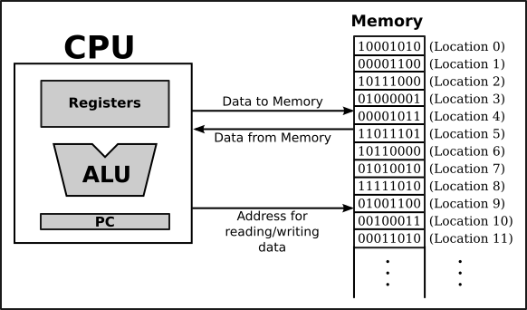
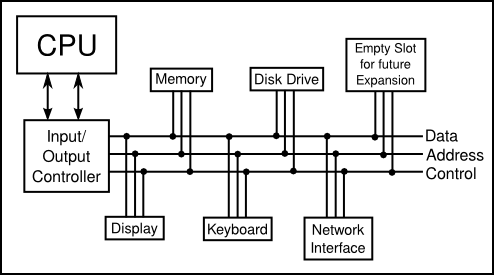
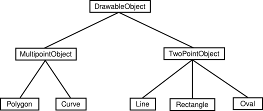

= Chapter 1. Overview: The Mental Landscape

== Section 1.1 The Fetch and Execute Cycle: Machine Language

=== Computer

* CPU (Central Processing Unit): 프로그램을 실행하는 것이 목표
* 기계어(Machine Language)라고 불리는 매우 간단한 유형의 언어로 작성된 명령을 수행

=== Program

* 컴퓨터가 기계적으로 따라야 하는 명확한 명령 목록

:hardbreaks:

=== CPU

* 프로그램을 실행할 때 해당 프로그램은 컴퓨터의 **main memory**에 저장된다.
* 이러한 **memory**에는 프로그램에서 사용하거나 처리하는 데이터를 저장할 수 있다.
* Fetch and Execute Cycle 
** CPU가 메인 메모리에 일련의 기계어 명령어로 저장된 프로그램을 실행
** 메모리에서 명령어를 반복적으로 읽거나 가져온(**fetching**) 다음 해당 명령어를 실행함으로써 수행된다.
** 위의 과정을 반복하는 것을 **__Fetch and Execute Cycle__**이라고 한다.

=== CPU 구성 요소

* ALU (Arithmetic Logic Unit)
** 덧셈과 뺄셈과 같은 연산을 수행하는 프로세서의 일부
* Legister
** 단일 숫자를 저장할 수 있는 작은 메모리 장치
* PC(Program Counter)
** CPU가 실행해야 하는 다음 명령어의 메모리 주소를 저장

=== Transistors

* 한 스위치의 출력이 다른 스위치를 켜거나 끌 수 있는 방식으로 서로 연결될 수 있는 특성을 지님
* 이러한 방식으로 컴퓨터는 수백만 개의 트랜지스터로 구성된 기계

== Section 1.2 Asynchronous Events: Polling Loops and Interrupts

=== Other devices

1. A hard disk or solid state drive
2. A keyboard and mouse
3. A monitor and printer
4. An audio output device
5. A network interface
6. A scanner

* CPU는 위의 모든 장치들과 통신하고 제어해야한다.

* 아래의 사진과 같이 장치를 버스에 연결하여 구성한다.

*위의 방식에서 CPU가 데이터가 들어온 것을 확인하는 방법은 무엇일까?*

=== Polling

* CPU가 데이터가 계속 들어오는지 확인하는 방법
* 매우 간단하지만 비효율적이라는 단점이 존재한다.
* CPU가 입력을 기다리는 것 자체가 엄청난 시간 낭비

=== Interrupts

* Polling 기법의 단점을 보완하기 위해 나온 기법
* **비효율성을 피하기 위해 주로 사용된다.**
* 다른 장치가 CPU에게 보내는 신호
* 다음과 같은 과정으로 CPU는 Interrupt를 처리한다.
  1. 컴퓨터 키보드를 누르면 키보드 인터럽트가 CPU로 전송
  2. CPU는 수행 중인 작업을 중단
  3. 사용자가 누른 키를 읽고 처리한 다음 원래 수행 중이던 작업으로 돌아감

* 이를 통해 CPU가 `asynchronous events(비동기 이벤트)`를 처리할 수 있음

=== Thread

* CPU가 수행하는 각각의 개별 작업
* CPU는 여러 개의 스레드를 동시에 실행할 수 있다.
* 다른 스레드에게 제어권을 양보할 수 있다.
* 비동기 이벤트가 발생하는 동안에는 *Blocked* 상태
* 할당한 시간이 지나면 강제로 일시 중단될 수 있다.

> Preemptive Multitasking(선점형 멀티태스킹) vs Cooper Multitasking(비선점형 멀티태스킹)

== Section 1.3 Java Virtual Machine

=== Compiler

* 고급 언어 프로그램을 실행 가능한 기계 언어 프로그램으로 변환
* 다른 유형의 컴퓨터에서 실행하려면 다른 컴파일러를 사용하여 적절한 기계어로 변환해야함.
* 이러한 불편한 과정을 해결하기 위해 자바에서는 JVM을 사용함

=== Java 소스코드에서 실행까지

1. 자바 소스 코드를 작성한다.
2. 자바 소스 파일을 컴파일한다 (javac Main.java)
3. 자바 컴파일러는 컴파일이 완성되면 클래스 파일 (Byte Code)를 생성한다.
4. 컴파일된 Byte Code를 JVM의 Class Loader에게 전달
5. 클래스 로더는 동적로딩을 통해 필요한 클래스들을 로딩 및 링크하여 런타임 데이터 영역, 즉 JVM의 메모리에 올린다.
6. 실행 엔진은 JVM의 메모리에 올라온 바이트 코드들을 명령어 단위로 하나씩 가져와서 실행, 이 때 실행 엔진은 두 가지 방식으로 변경
** 컴파일러: 바이트 코드 **전체**가 컴파일된 바이너리 코드를 실행
** 인터프리터: 바이트 코드 명령어를 **하나씩** 읽고 해석하고 실행

> JIT Compiler : 특정 부분이 여러번 실행이 되는 프로그램의 특성을 이용한 컴파일러

=== JVM(Java Virtual Machine)

* 모든 환경에서 사용할 수 있다.
* JVM의 기계언어를 **Java Byte Code**라고 한다.
* JVM은 다른 프로그램을 실행시키는 것이 목적

image:images/overview-fig3.png[]

== Section 1.4 Fundamental Building Blocks of Programs

=== Variable

* 쉽게 참조하고 사용할 수 있도록 이름이 지정된 메모리 위치
* 데이터를 저장할 수 있는 일종의 '상자'

=== Type

* 변수가 보유할 수 있는 데이터의 종류
* 정수, 문자열 ...

=== Control structure

* loops

* branches

[source, java]
  if (원금 > 10000) {
    이자 = 원금 * 0.05;
  }
  else {
    이자 = 원금 * 0.04;
  }

=== Subroutine

* Java에서의 Main = routine
* Routine에서 호출하는 함수(메서드) *> subroutine

== Section 1.5 Objects and Object*Oriented Programming

=== Information hiding

* 소프트웨어 공학의 가장 중요한 원칙 중 하나
* 모듈 내부에서 진행되는 세부 사항은 시스템 전체에 중요하지 않다.

=== 객체 지향 프로그래밍 (Object*Oriented Programming)

* 중심 개념: 데이터와 서브루틴을 포함하는 일종의 모듈인 **객체**

=== Polymorphism

* 서로 다른 개체가 동일한 메시지에 서로 다른 방식으로 응답할 수 있는 개체의 속성

=== Inheritance

* 소프트웨어 구성 요소를 재사용하는 문제와 관련이 있음
* 부모와 자식의 관계 (subclasses)

== Section1.7 The Internet and Beyond

=== Protocol

* 통신이 어떻게 진행되는지에 대한 규약
* 인터넷 프로토콜(IP)
* 전송 제어 프로토콜(TCP)

=== IP address

* 인터넷 상의 모든 컴퓨터의 고유 식별 번호
* 패킷 주소 지정에 사용

