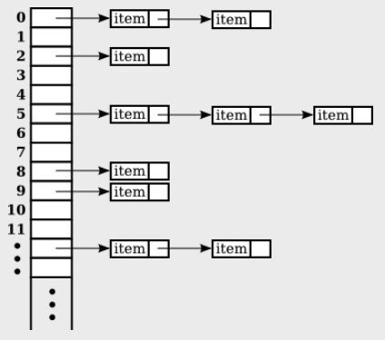
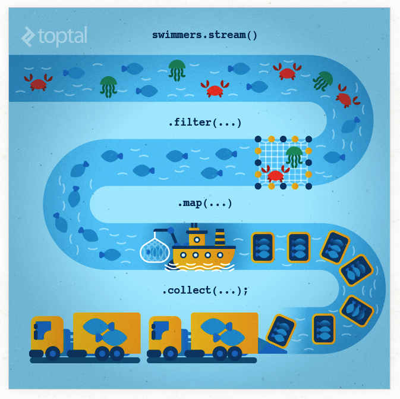

= Chapter 10 Generic Programming and Collection Classes

== Section 1 Generic Programming

=== 10.1.1 Generic Programming in Smalltalk
.Smalltalk
* Smalltalk은 최초의 object-oriented programming language 중 하나이다.
* Smalltalk은 language의 두 가지 기본적인 특성 때문에 모든 프로그래밍이 generic이다.
* Smalltalk의 변수들은 type이 없다.
** integer, string과 같은 data value는 type이 있다. 하지만 variable들은 type이 없다.
** parameter들도 type이 없기 때문에 subroutine은 모든 type의 parameter value에 적용될 수 있어야 한다.
** data structure는 모든 type의 data value를 담을 수 있다.
* 모든 data type들은 object이고 모든 object들에 대한 operation들은 class의 method로 define 되어 있다.
** 이는 Java에서 integer와 같은 primitive type에 대해서도 사실이다.
** "+" 연산자를 사용하여 integer 두 개를 더하면 integer class에서 method를 호출하여 연산을 수행한다.
** 새 클래스를 정의할 때 "+" 연산자를 정의하면 숫자를 추가하는 것처럼 "a + b"라고 말하면 해당 클래스에 속한 개체를 추가할 수 있다.
* 이러한 방식으로 프로그래밍 언어를 설계하지 않는 이유는 이같은 자유는 프로그램을 작성하는 것을 더 쉽게 만들지만, correct and robust한 프로그램을 작성하는 것을 더 어렵게 한다.
** If you have a subroutine that can sort any type of data, it's hard to ensure that it will only be applied to data for which the "<" operator is defined.
** There is no way for a compiler to ensure these things. The problem will only show up at run time when an attempt is made to apply some operation to a data type for which it is not defined, and the program will crash.

=== 10.1.2  Generic Programming in C++
* Smalltalk과는 다르게, C++은 매우 강하게 typed language다. 모든 variable은 type을 가질 수 있고, 해당 type의 value만 담을 수 있다.
** 이것은 Smalltalk에서 사용된 종류의 generic programming이 C++에서는 불가능하다는 뜻이다.
** 그럼에도 불구하고 C++은 template이라고 알려진 언어의 특징으로 generic programming을 가능하게 한다.
[source, c++]
----
template<class ItemType>
void sort( ItemType A[], int count ) {
      // Sort items in the array, A, into increasing order.
      // The items in positions 0, 1, 2, ..., (count-1) are sorted.
      // The algorithm that is used here is selection sort.
   for (int i = count-1; i > 0; i--) {
      int position_of_max = 0;
      for (int j = 1; j <= i ; j++)
         if ( A[j] > A[position_of_max] )
            position_of_max = j;
      ItemType temp = A[i];
      A[i] = A[position_of_max];
      A[position_of_max] = temp;
   }
}
----

* 첫 줄은 Java의 <T>와 같은 표현이다.
* 만약 당신의 프로그램이 list가 int array일 때 "sort(list, 10)" 라고 다면, 컴파일러는 int array를 sort하기 위한 subroutine을 생성핳기 위해 template을 사용한다.
** 만약 sort하기 위한 operator가 해당 class에 define되어 있지 않다면, 컴파일러는 실패할 것이다. 그러나 이는 Smalltalk애서처럼 프로그램을 죽이는 runtime이 아닌 compile time에 발생한다. 
* 또한 C++은 class를 만드는 template도 있다.
** 만약 binary tree class를 위한 template을 작성한다면, int, string, date 등등을 위한 binary tree에 대한 class를 하나의 template에서 생성할 수 있다.
* Modern C++은 다수의 Standard Template Library or STL이라고 불리는 이미 작성된 template로 구성되어 있다.

=== 9.1.3 Generic Programming in Java
* 초기의 Java는 parameterized type을 사용하는 것이 아닌 Object를 사용하여 Generic programming을 표현했다.
** ArrayList로 예를 들면, ArrayList는 parameterized type이 아니었기 때문에 모든 유형의 object를 가질 수 있었다.
** 이는 list.get(i) 가 Object type의 값을 반환한다는 의미이다.
** 사용자 쪽에서 type casting을 해주어야 한다. 그러나 이는 Smalltalk처럼 compile time에 type check를 할 방법이 없다. -> runtime에 알 수 있다.
** 만약 object가 String type이 아니라면 ClassCastException type의 에러가 던져질 것이다. 
[source, java]
----
String item = (String)list.get(i);
----

* Java 5.0에서는 parameterized type을 도입해 runtime이 아닌 compile time에 type-checked가 가능한 generic data structure를 생성할 수 있게 되었다.
* Java의 parameterized class와 C++의 template class에는 상당한 차이가 있다.
** template class는 실제로 class가 아니라 class를 생성하기 위한 factory다. template이 새로운 type으로 사양될 때마다 새로운 컴파일된 class가 생성된다.
** parameterized class는 오직 한 개의 컴파일된 class file만 있다. 예를 들어, parameterized class ArrayList에 대해 컴파일된 클래스 파일 ArrayList.class 하나만 있다. 
*** parameterized type ArrayList<String> 와 ArrayList<Integer>는 모두 일반 ArrayList와 마찬가지로 동일한 컴파일된 클래스 파일을 사용한다.
*** type parameter-String or Integer-는 단지 data structure에 저장할 수 있는 object type을 제한하도록 컴파일러에 지시한다.
*** type parameter는 runtime에 영향ㅇ을 미치지 않으며 런타임에 알려지지도 않는다.
*** if (list instance of ArrayList<String>) -> instanceof 메서드는 runtime에 평가되고 runtime에는 plain ArrayList만 존재하므로 테스트할 수 없다.
*** ArrayList<String>으로 type casting할 수 없다. -> 무슨 말인지 모르겠음.
*** 심지어 ArrayList<String>을 base type으로 갖는 ArrayList를 new 연산자를 사용하여 만들 수 없다. -> new 연산자는 runt time에 평가되고 run time에는 "ArrayList<String>"과 같은 것은 없기 때문이다. 오직 non-parameterized type ArrayList만 run time에 존재한다.

=== 10.1.4  The Java Collection Framework
* Java는 common data structure를 구현하는 다수의 parameterized types들과 함께 제공된다. 이 data structure class들과 interface collection들은 Java Collection Framework, or JCF라고 불린다.
* JCF의 generic data structure들은 두 개의 category로 나뉜다. : collections and maps.
** Collection은 말 그대로 objects 들의 collection이고, 사전이 정의를 단어와 연결하거나, 전화번호부가 전화번호를 이름과 연결하는 것처럼 Map은 one set with objects를 다른 set와 연결짓는다.
** Collection과 Map은 Collection<T> and Map<T,S>로 표현된다. 여기서 T와 S는 primitive type을 제외한 모든 type을 나타낸다.
.Collection
* Collection에는 list 와 set라는 두 가지 type이 있다.
** list는 object들이 선형 순서로 배열된 collection이다. 
*** list에 있는 모든 item들은 마지막을 제외하고 바로 뒤에 따라오는 item이 있다.
** set의 defining property는 어떤 object도 set에서 두 번 이상 나타날 수 없다는 것이다. -> 중복을 허용하지 않는다. 또한 특정 element가 반드시 특정 순서로 존재하는 것으로 간주되는 것은 아니다.
** List<T>, Set<T>로 표현된다. 이는 Collection<T>의 하위 interface이다. Collection<T> interface는 모든 Collection에 적용할 수 있는 일반 작업을 지정하고, List<T> 및 Set<T>는 각각 List와 Set에 적합한 추가 operation을 추가한다.
* 일부 컬렉션의 크기는 생성된 후에 변경할 수 없습니다. 개체를 추가하거나 제거하는 메서드는 이러한 컬렉션에 적합하지 않습니다. 메서드를 호출하는 것은 여전히 ​​적법하지만 런타임에 호출이 평가되면 예외가 발생합니다. 예외 유형은 UnsupportedOperationException 입니다

=== 10.1.5  Iterators and for-each Loops
* Iterator : Collection을 순회하는데 사용할 수 있는 object.
** Iterator는 Collection들의 type에 따라 다른 방식으로 구현되지만, 모든 iterator들은 같은 방식으로 쓰인다.
** Collection<T>에는 Iterator를 얻을 수 있는 iterator() method가 정의되어 있다.
** Iterator는 Iterator<T>로 이름지어진 parameterized interface에 의해 정의된다.
** Iterator<T>에는 3가지 method가 정의되어 있다. :
*** next() - 다음 item을 return한다. Iterator를 전진시킨다. Iterator를 전진시키지 않고서는 다음 item들을 볼 방법이 없다.
*** hasNext() - returns a boolean value. return 시킬 값이 남아있다면 true를 return. next()를 호출하기 전에 hasNext()를 테스트해야함.
*** move() - next()를 호출한 후 이를 호출하면 Collection에서 방금 본 item이 제거된다. next()에 의해 가장 최근에 반환된 항목을 제거한다. remove()를 지원하지 않는 경우 UnsupportedOperationException이 발생할 수 있다.

=== 10.1.6  Equality and Comparison
* Object에 equals method는 obj1 == obj2 이런 식으로 간단하게 정의되어 있기 때문에 새로 만든 type class에서 equals method를 오버라이딩 해줘야 함.
** obj1 == obj2 -> 객체의 주소를 비교함.
* 객체의 비교를 위해 Comparable을 implements 하고 compareTo method를 implements한다.

=== 10.1.7  Generics and Wrapper Classes
* primitive type boolean -> wrapper class Boolean이 있다.
* int배열이 ArrayList<Integer> 보다 효율적이다.

== Section 2

=== 10.2.1 ArrayList and LinkedList
* list : 선형 순서로 배열된 item들의 연속으로 구성됨. 명확한 순서가 있지만, 반드시 정렬되어있는건 아니다.
* set : 중복된 entry가 없는 collection이다. set의 element는 명확한 순서로 배열될 수 있고 없을 수도 있다.
* List<T>가 class가 아니고 List<T>를 interface로 두고 List를 implements하는 ArrayList와 LinkedList 두 개의 class가 있는 이유 :
** 모든 operation에 효율적인 single representation of list가 없다.
** 즉 어떤 operation은 ArrayList가 효율적이고, 다른 어떤 operation은 LinkedList가 효율적이라서 둘 다 존재하는 것이다.
** LinkedList class는 list의 시작 부분이나 list 중간에 item이 자주 추가되거나 제거되는 응용 프로그램에서 더 호율적이다.
** ArrayList는 random access가 필요한 경우 더 효율적이다. ->코드를 짤 때 더 효율적인 list 생각하고 쓰기 -> 이 내용 중요(유용준)
** sorting과 list 끝에 item을 추가하는 것은 둘 다 효율적이다.
* List interface의 method :
** get(index), set(index, obj), add(index, obj), remove(index), indexOf(obj)
** 이러한 method는 ArrayList<T> class와 LinkedList<T> class 모두에 정의되어 있지만, get, set과 같은 일부 method는 ArrayList에만 효율적이다. 
* LinkedList<T> class에는 있지만 ArrayList에는 없는 method :
** getFirst() : list의 첫 번째 item return. list는 수정되지 않음. method가 호출될 때 list가 비어 있으면 NoSuchElementException type의 Exception 발생(다음 3개의 method에도 마찬가지).
** getLast() : list의 마지막 item return. list는 수정되지 않음. 
** removeFirst() : list의 첫 번째 item 제거, 해당 object를 return.
** remove() or pop() : removeFirst()와 동일한 의미.
** removeLast() : list의 마지막 item 제거하고 해당 object를 return.
** addFirst(obj) or push(obj) : obj를 list의 시작 부분에 추가. 
** addLast(obj) add(obj) : obj를 list의 끝에 추가.
* List에는 추가 기능을 제공하는 ListIterator라는 특별한 Iterator가 있다. ListIterator<T>는 Iterator<T>를 확장하는 interface다.
** hasPrevious() : 이전 값이 있는지 확인.
** previous() : 이전 값으로 이동
** remove() : next() or previous()에 의해 가장 최근에 return된 item을 제거.
** add(obj) : Iterator의 현재 위치에 obj를 추가.
** set(obj) : remove()에 의해 삭제된 곳에 obj를 대치.
* LinkedList<T>는 doubly linked list다. 
** 하나는 다음 노드, 다른 하나는 이전 노드를 가리킴.
** ListIterator의 next()와 previous()를 효율적으로 구현하는게 해줌.
** LinkedList의 getLast()와 addLast()를 위해 "tail pointer"도 포함한다.

=== 10.2.2 Sorting
[source, java]
----
Collections.sort(list); // 
Collections.sort(list, comparator);
----
* Collections.sort 는 merge-sort로 구현되어 있다. merge-sort는 worst-case와 average-case의 실행 시간이 Θ(n*log(n))이다. quick-sort가 average-case에 merge-sort보다 빠르지만 worst-case의 경우에 merge-sort가 quick-sort보다 훨씬 더 빠르다. (merge-sort는 또한 stability 불리는 좋은 특성을 가지고 있다.)
** stability : 안정성. 동일한 원소에 대하여 정렬 후 본래의 순서가 유지되는 특성.

=== 10.2.3 TreeSet and HashSet
.TreeSet
* TreeSet은 Set의 element가 오름차순으로 정렬되는 속성이 있다. 즉, TreeSet의 Iterator or for-each loop는 항상 오름차순으로 element를 방문한다.
* TreeSet에는 포함된 object의 정렬 순서를 결정하는 방법이 있어야 하므로 TreeSet<T> type Set의 object가 Comparable<T> interface를 구현해야 하며 obj1.compareTo(obj2)가 Set의 두 object obj1, obj2에 대해 합리적인 방식으로 정의되어야 한다.
* 또는 TreeSet을 생성할 때 Comparator<T> type의 object를 생성자에 대한 parameter로 제공할 수 있다.
[source, java]
----
TreeSet <class-name> treeSet = new TreeSet<>(); // comparable이 구현된 class
TreeSet <class-name> treeSet = new TreeSet<>(new comparator-name); // comparable이 구현되지 않은 클래스
----
* compare() or compareTo() method를 합리적으로, 제대로 정의하지 않으면 add() subroutine이 호출될 때 정렬되어 삽입해야하기 때문에 비교한 후 한 두 object가 같다고 판단되어 한 object가 TreeSet에서 사라질 수 있다. 주의해야함. -> example/TreeSetComparableTest.java에서 테스트 해봄.
* 자바의 모든 collection class에는 collection을 argument로 사용하는 생성자가 있다. 
[source, java]
----
TreeSet<String> set = new TreeSet<String>();
set.addAll(coll);
ArrayList<String> list = new ArrayList<String>();
list.addAll(set);

ArrayList<String> list = new ArrayList<>( new TreeSet<>(coll) ); //위의 4줄을 한 줄로 줄임.
----

.HashSet
* HashSet은 hash table에 element를 저장한다.
* search, add, remove operation들은 hash table에서 TreeSet보다 매우 효율적으로 구현된다. 
* HashSet은 특별한 순서로 element를 저장하지 않기 때문에 Comparable interface의 구현이 필요 없다. (하지만 적절한 hash code의 정의가 필요하다.)
* equals () 메소드는 HashSet 의 두 객체가 동일한 것으로 간주되는지 여부를 결정하는 데 사용됩니다 . HashSet 의 Iterator 는 완전히 임의적인 순서로 해당 요소를 방문하며 새 요소가 추가되면 순서가 변경되는 것도 가능합니다. 포함된 요소가 비교할 수 없거나 순서가 중요하지 않거나 효율성의 작은 이점이 중요한 경우 TreeSet 대신 HashSet을 사용합니다 .
* A note about the mathematics of sets
** operations : A는 Set type의 variable
*** A.add(x) : x를 A에 추가
*** A.remove(x) : x를 A에서 제거
*** A.contains(x) : x가 A의 요소인지 테스트.
*** A.addAll(B) : A와 B의 합집합
*** A.retainAll(B) : A와 B의 교집합
*** A.removeAll(B) : A - B를 계산. 차집합.
** 수학의 집합은 집합이 무한하지만 Java는 유한하다.
** 수학의 집합은 임의의 요소를 포함할 수 있지만, Java는 특정한 <T>, T유형의 요소만 포함할 수 있다.
** A.addAll(B)는 A 값을 수정하여 작동하지만, 수학에서 A union B는 A 또는 B의 값을 변경하지 않고 새 집합을 계산한다.

=== 10.2.4 Priority Queues
* Priority Queue는 item의 collection을 표현하는 하나의 ADT로, 두 item을 비교할 수 있는 우선순위가 있다.
* operation에는 add와 우선순위가 가장 낮은 item을 반환하는 remove가 있다.
* Priority Queue의 간단한 구현은 LinkedList를 사용하여 우선순위가 높아지는 순서대로 큐에 항목을 저장함으로써 구현할 수 있다. remove는 첫 번째 item을 제거하고 return한다. 그러나 add는 우선순위에 맞게 삽입해야한다. (효율적인 구현에서는 "heap"을 사용하는데, 이는 object가 생성되는 heap과 혼동하지 않아야 한다.)
* 필수 operation으로는
** add(obj) : obj를 priority queue에 추가한다.
** remove() : 최소 우선순위의 item을 제거하고 반환한다. queue가 비었다면 예외가 발생한다.
** isEmpty() : priority queue가 비었는지 테스트한다.
* priority queue의 우선순위 결정 :
** item이 Comparable interface를 구현
** Comparator object를 PriorityQueue 생성자에 대한 parameter로 제공.
* priority queue는 for-each loop나 iterator로 순회 불가능. -> 오름차순으로 순회하지 않기 때문에.
* priority queue의 자연스러운 용도로는 컴퓨터의 "jobs" 예약 문제.

== Section 10.3 Maps
* Array의 get과 put operation은 배열이라는 것이 무엇을 의미하는지 정의한다.
* Array와 마찬가지로 Map은 get과 put operation으로 정의된다. 그러나 Map은 0, 1, ..., N-1(index)이 아닌 특정 type T의 임의 object에 대해 정의된다.
* Map은 Array와 비슷하지만 Map의 index는 정수가 아닌 object이다. Map의 index = key, 연관된 object를 value라고 한다.

=== 10.3.1 Map Interface
* Map의 Operation
** map.get(key) - key에 연결된 V type의 object return. Map에서 key가 value와 연결되어 있지 않으면 return value = null이다.
** map.put(key, value) - key와 value를 연결한다. Map이 이미 다른 값을 키와 연결한 경우, 갱신된다.
** map.putAll(map2) - map2가 Map<K,V>유형의 또 다른 Map인 경우 map2의 모든 associations를 map으로 복사한다.
** 등등...
* Java에는 Map<K,V> interface를 구현하는 TreeMap<K,V>와 HashMap<K,V>가 포함되어 있다.
** TreeMap에서 key/value association은 정렬된 tree에 저장되며, 여기서는 key에 따라 정렬된다. -> key를 비교할 수 있어야 한다.(Comparable or Comparator) -> equals 대신 CompareTo(or Compare)가 사용되므로 implements할 때 주의해야한다.
** HashMap은 특정 순서로 association을 저장하지 않기 때문에 HashMap에서 사용할 수 있는 키를 비교할 필요가 없다. 그러나 key class에는 equals(), hashCode() method에 대한 합리적인 정의가 있어야 한다.
* 대부분의 operation들은 TreeMap보다 HashMap이 더 빠르다. 순서가 필요하다면 TreeMap을 사용하고 그렇지 않다면 HashMap을 사용하는게 좋다.

=== 10.3.2  Views, SubSets, and SubMaps
* Map은 Collection이 아니며 Map은 Collection에 정의된 모든 작업을 구현하지 않는다. 특히, Map에는 Iterator가 없다. Iterator의 역할이 필요한 경우 map.keySet()을 활용해 Iterator의 역할을 대신한다. keySet()은 Set<K>를 return한다.
* 새로운 Set<K>를 만들어 return하는 것이 아니라 실제 Map의 key를 참조하는 것이기 때문에 keySet의 key value를 삭제하면 실제 Map에서도 삭제가 이루어진다.
* It is what is called a view of the actual objects that are stored in the map.
* Map은 2개의 다른 view를 구현한다.
** map.values() -> Map<K,V>에서 V, value는 중복 값을 허용하기 때문에 Set<V>가 아닌 Collection<V> type의 object가 return된다.
** map.entrySet() -> Map interface안에 static nested interface 정의된 Entry<K,V> type의 object가 return된다. 그래서 Map.Entry<K,V>는 full name이다. return type은 Set<Map.Entry<K,V>>
[source, java]
----
Set<Map.Entry<Integer, Integer>> entries = map.entrySet(); // entrySet()의 return 값 받기.

Iterator<Map.Entry<Integer, Integer>> iter = entries.iterator();
        for (Map.Entry<Integer, Integer> entry : entries) {
            System.out.println(entry.getKey() + " " + entry.getValue());
        } // iterator를 통해 key, value 접근

for (Map.Entry<Integer, Integer> entry : map.entrySet()) {
            System.out.println(entry.getKey() + " " + entry.getValue());
        } // for-each loop를 통해 접근.
          // var를 사용하면 더욱 쉽게 사용할 수 있음.
----

* Java에서 view가 사용되는 곳
** List<T> interface의 list.subList(fromIndex, toIndex) : list의 fromIndex부터 toIndex사이의 뷰를 반환함. -> 변경사항이 원본에도 적용됨.
** TreeSet<T> type인 경우 set.subSet(fromElement, toElement) : set의 fromElement와 toElement사이에 있는 set의 모든 요수를 포함하는 Set<T>를 return한다. fromElement와 toElement는 T type의 object여야 한다. 
*** ex) words.subSet("m", "n")인 경우 문자'm'으로 시작하는 단어의 모든 element를 포함한다. -> 마찬가지로 하위 Set에 대한 변경이 원본에도 적용된다.
** Map<K,V>가 TreeMap<K,V> type의 object라고 가정하면
*** map.subMap(fromKey, toKey) -> fromKey부터 toKey까지의 모든 key/value pair를 반환함.
*** map.headmap(toKey), map.tailMap(fromKey) -> headSet, tailSet과 유사하게 구현되어있음.
* subrange query

=== 10.3.3  Hash Tables and Hash Codes
* hash table은 searching에 대한 우아한 솔루션이다. 
** 대부분의 search algorithm에서는 찾고자 하는 값을 찾기 위해서는 다른 값들도 많이 봐야한다.
** hash table에서는 key/value pair를 검색하면 원하는 item이 포함된 위치로 바로 이동할 수 있다. key/value의 위치는 key에 의해 계산된다. key만 보면 key가 있는 위치로 바로 이동한다.
** key가 저장되는 배열 인덱스는 key를 기반으로 한다. 인덳는 key와 동일하지 않지만 key에서 계산된다. 
*** 키의 배열 인덱스를 해당 키의 hashcode라고 한다.
*** 키가 주어지면 해시 코드를 계산하는 함수를 hash function이라고 한다.
* Collision : 동일한 배열 공간에 2개 이상의 key 값을 저장하려고 하는 것. 즉 다른 2개 이상의 key값의 입력에 같은 출력이 나온 것이다.
** Hash Table은 합리적인 방식으로 Collision을 처리할 수 있어야 한다.
* HashTable의 구조

//-
* 이와 같은 구조가 제대로 작동하려면 Hash Table의 item 수가 배열의 index 수보다 약간 적어야 한다. Java에서는 item 수가 배열 크기의 75%를 초과할 때마다 배열이 더 큰 배열로 대체되고 이전 배열의 모든 항목이 새 배열에 삽입된다.
* Hash Code는 Math.abs(obj.hashCode()) % N 이다.
* Hashing이 제대로 작동하려면 equals() method에 따라 동일한 두 객체가 동일한 hash code를 가져야 한다.
** Object class는 equals()와 hashCode()가 모두 객체가 저장된 메모리 위치의 주소를 기반으로 하기 때문에 이 조건이 충족된다.
** 하지만 새로운 type의 class를 만들고 equals()를 overriding한다면 hashCode() 또한 overriding해야만 한다.
* 좋은 hash function을 작성하는 것은 중요하다.

== Section 10.4 Programming with the Java Collection Framework

=== 10.4.1  Symbol Tables
* Symblo Table : 변수가 기억공간을 할당 받으면 변수의 주소가 등록되는 테이블이다.
** Symbol Table의 key는 변수 이름이고, value는 해당 변수의 값이다.
** ex) double symbol table은 Map<String, Double>유형의 object가 된다.

=== 10.4.2  Sets Inside a Map
* Collection or Map의 object는 모든 type이 될 수 있다. Collection이 될 수도 있다.
** ex) Map의 value로 Set를 사용할 수 있다.
** 책의 index를 만든다고 가정하면, TreeMap<String, TreeSet<Integer>> Type일 수 있다. 밑의 코드는 String term에 대한 pageNum을 삽입하는 subroutine이다.
[source, java]
----
/**
 * Add a page reference to the index.
 */
void addReference(String term, int pageNum) {
   TreeSet<Integer> references; // The set of page references that we
                                //    have so far for the term.
   references = index.get(term);
   if (references == null){
          // This is the first reference that we have
          // found for the term.  Make a new set containing
          // the page number and add it to the index, with
          // the term as the key.
       TreeSet<Integer> firstRef = new TreeSet<>();
       firstRef.add( pageNum );  // pageNum is "autoboxed" to give an Integer!
       index.put(term,firstRef);
   }
   else {
         // references is the set of page references
         // that we have found previously for the term.
         // Add the new page number to that set.  This
         // set is already associated to term in the index.
      references.add( pageNum );
   }
}
----

=== 10.4.3 10.4.3  Using a Comparator
* 위에서 만든 index의 문제점은 대문자와 소문자를 알파벳 순서로 제공하는 것이 아닌 A-Z까지 그리고 a-z순서로 출력한다는 것이다. Comparator<T>를 사용해 이를 해결할 수 있다.
** Comparator는 functional interface이기 때문에 람다식을 사용할 수 있다.
*** 여기에도 문제가 있는데 "abc" 와 "Abc"를 같은 값으로 보기 때문에 하나로 합쳐지는 결과가 나타난다.
[source, java]
----
(a,b) -> a.compareToIgnoreCase(b)

index = new TreeMap<>( (a,b) -> a.compareToIgnoreCase(b) );
index = new TreeMap<>( String::compareToIgnoreCase ); 
//String class에 이미 존재하는 메서드를 호출하기 때문에 method reference로 제공할 수 있음.
----

=== 10.4.4  Word Counting
* Collections.sort()에서 사용하는 정렬 알고리즘인 merge-sort는 안정적이고 빠르다.
** 안정적이다 : sort과정에서 동일한 값을 가지는 item들은 그 순서가 보장된다.
*** 여기서 나온 예제를 예시로 들면 ArrayList에는 word 알파벳(String) 순서로 들어가 있다. Collections.sort(ArrayList-name, (a,b) -> b.count - a.count); 를 통해 count값으로 정렬을 한 경우 동일한 count값에 대해서는 알파벳 순서가 유지되어있다.

== Section 10.5 Writing Generic Classes and Methods
=== 10.5.1  Simple Generic Classes
* Generic Programming은 재사용 가능한 코드를 생성한다.
=== 10.5.2  Simple Generic Methods
* Note that when a generic method is used, as in the function call "countOccurrences(wordlist, word)", there is no explicit mention of the type that is substituted for the type parameter. 
** 컴파일러는 메서드 호출의 actual parameters의 type을 통해 T의 type을 추론한다.
** type parameter가 명시적으로 지정된 "Queue<String>"에서와 같이 generic class를 사용하는 것과 대조된다.

=== 10.5.3  Wildcard Types
* Generic Programming에 사용되는 type에 제한을 두기 위한 서로 다르지만 관련된 구문이 두 가지 있다.
** bounded type parameter : generic class or method 정의에서 formal type parameter로 사용된다.
** class GenericClass<T> ... 또는 public static <T> void genericMEthod(...)에서 simple type parameter T로 사용된다.
** wildcard types : used as type parameters in the declarations of variables and of formal parameters in method definitions
*** ex) List<String> list, void concat(Collection<String> c)

.WildCard
* <? extends T> : T와 같거나 T의 subtype
* <? super T> : T와 같거나 T의 super type

=== 10.5.4  Bounded Types
* Bounded Type과 WildCard Type의 차이 :
** A bounded type can be used only as a formal type parameter in the definition of a generic method, class, or interface.
** A wildcard type is used most often to declare the type of a formal parameter in a method and cannot be used as a formal type parameter.
** 또 다른 차이점으로, Bounded Type은 super는 사용할 수 없다는 것이다.

== Section 10.6 Introduction the Stream API

=== 10.6.3 Operations on Streams

* Some operations on a stream produce another stream. They are referred to as "intermediate operations" because you will still have to do something with the resulting stream to produce a final result. "Terminal operations" on the other hand apply to a stream and produce a result that is not a stream.
* The two most basic intermediate operations are filter and map
** A filter applies a Predicate to a stream, and it creates a new stream consisting of the values from the original stream for which the predicate is true
[source, java]
----
IntSteam.range(2,1000).filter( n -> isPrime(n) )
----

* A map applies a Function to each value in a stream, and creates a stream consisting of the output values.
[source, java]
----
strList.stream().filter( s -> (s != null) ).map( s -> s.toLowerCase() )
----
*ex)

* Stream pattern : 스트림 생성, 일부 intermediate operations 적용, terminal operations 적용.