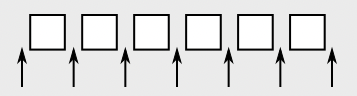
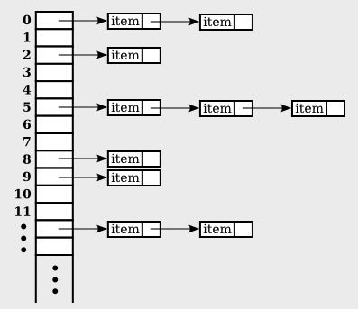

= Chapter10

== **Generic Programming**

* 다양한 타입의 데이터에 동작하는 코드를 작성하는 것.
** ArrayList<String>, ArrayList<Integer> ... 

=== **Generic Programming in C++**
* template을 사용해서 구현

=== **Generic Programming in Java**
* 초기의 자바엔 parameterized type이 존재하지 않았다.
* 모든 class의 super class인 Object class를 사용.
* 하지만 모든 종류의 object를 저장할 수 있지만 저장한 compile time에 객체의 type을 체크할 방법이 없기 때문에 문제 발생.
* java 5.0 부터 parameterzied type이 도입.
* 구현은 매우 다르지만 자바의 parameterized type은 c++의 template과 유사.

type erasure::
ArrayList<String>은 list에 저장될 수 있는 객체의 종률를 String으로 제한하는 것 뿐이며, runtime에는 영향을 미치지 않는다. type에 대한 정보는 runtime에 삭제 된다.
* instanceof 연산자를 통해서 ArrayList<String>을 체크하려고 하는 것은 어리석은 짓.
* instanceof 연산자는 runtime에 type을 체크하지만 이미 List의 타입은 삭제 되고 ArrayList만 존재하기 때문에 수행할 수 없다.

=== **The Java Collection Framework (JCF)**
* 1. Collection
**  객체들의 Collection
----
Collection<T>

coll.toArray() // coll의 모든 객체를 포함하는 Object type의 배열을 반환
coll.toArray(tarray) // T 타입의 배열을 반환
----

* 2. Map
** 전화번호부가 이름과 전화번호를 연관시키는 것 처럼 한 객체의 집합을 다른 객체의 집합과 연결한다.
----
Map<T, S>
// T, S : primitive type을 제외한 모든 타입
----

List::
객체가 선형 시퀀스에 배열된 Collection
----
List<T>
----

Set::
* 중복을 허락하지 않는다.
* 순서가 존재하지 않아서 index를 통한 접근이 불가능하다.

----
Set<T>
----

=== **Iterators and for-each Loops**
Iterator : 컬렉션을 순회하는데 사용하는 객체.
[source]
----
Iterator<String> iter = coll.iterator();
// coll의 타입이 String인 Collection이라면 String 타입의 iterator를 생성 할 수 있다.
----

for-each : iterator를 사용하지 않고 Collection의 각 요소에 접근할 수 있다.
[source]
----
for(String name : namelist) {

}
----

=== **Equality and Comparison**
* '==' 연산자로 객체를 비교하는것은 의미가 없다.
* 같은 메모리에 위치하는지를 비교하기 때문이다.
* Object 클래스의 obj1.equals(obj2)는 obj1 == obj2 처럼 구현되어 있기 때문에 해당 메소드를 오버라이딩해서 사용해야 한다.

Comparison::
* Comparable<T>, Comparator<T>
[source]
----
public int compareTo(T other){}         // Comparable<T>
public int compare(T obj1, T obj2){}    // Comparator<T>
----

=== **ArrayListr and LinkedList**
ArrayList<T> : T 타입의 객체들의 순서가 있는 시퀀스, 새로운 객체가 추가되면 배열의 크기를 확장시켜서 저장한다.
LinkedList<T> : T 타입의 객체들의 순서가 있는 시퀀스, 객체들을 포인터로 연결된 노드에 저장한다.

* 왜 단일 List가 아닌 ArrayList, LinkedList로 나눴을까?
** 각자 효율적인 작업을 할 수 있는 부분이 달라서.
** LinkedList는 리스트의 시작이나 중간에 자주 추가되거나 제거되는 프로그램에에서 효율적이다.
** ArrayList는 항목에 대한 무작위 접근이 필요한 경우에 더 효율적이다.

List에는 iterator가 존재하지만 listiterator라는 특수한 iterator가 존재한다.
* iterator의 메소드인 hasnext(), next() remove()를 포함하며
hasPrevious(), previous(), add(obj), set(obj) 같이 리스트의 뒤로 이동하거나 현재 위치에 객체를 추가할 수 있다.

=== **Sorting**
[source]
----
Collections.sort(list);
Collections.sort(list, comparator);
----

== **TreeSet and HashSet**
TreeSet : 요소가 오름차순으로 정렬되어 있다. +
TreeSet<T>에서 T 객체는 comparable<T>로 정렬할 방법이 정의되어 있어야 한다. +
또는 TreeSet<T>를 생성할 때 Comparator<T> 객체를 지정해 줘야 한다. +
TreeSet은 객체를 비교할 때 equals를 사용하지 않는다. compareTo나 compare 메소드를 사용한다.+
그렇기 때문에 compareTo() 메소드나 compare() 메소드를 잘못 정의하게 된다면 다른 객체이지만 같은 객체로 인식해서 두 객체중 한 객체를 추가하지 못할 수 있다.

간편하게 중복을 제거하고 comparable이 잘 정의되어 있다면
[source]
----
TreeSet<String> set = new TreeSet<String>();
set.addAll(coll);
// 중복을 제거하고 정렬
ArrayList<String> list = new ArrayList<String>();
list.addAll(set);
// Set을 통해서 중복을 없애고 정렬을 한 이후 다시 ArrayList에 객체를 추가할 수 있다.

ArrayList<String> list = new ArrayList<>( new TreeSet<>(coll) );
//이렇게도 사용 가능!
----

HashSet : Hash Table에 객체를 저장한다. +
객체를 특정 순서로 저장하지 않아서 Compaable 인터페이스를 구현할 필요가 없다.

=== **Priority Queues**
각 객체에 할당된 우선순위를 가진 ADT. +
add() 메서드를 통해서 객체를 추가하고 remove() 메서드를 통해서 우선 순위가 가장 작은 객체를 제거하고 반환한다.

== **Maps**
key: index처럼 사용되는 객체 +
value: key와 관련된 객체.

NOTE:
key는 하나의 value값만 가질 수 있지만, value는 여러 다른 key를 가질 수 있다.

TreeMap::
key와 value를 key를 기준으로 정렬시킨다.

HashMap::
특정한 순서로 저장하지 않는다. +
하지만 equals메서드와 hashcode메서드에 대해서 정의할 필요가 있다.

=== **Views, SubSets, and SubMaps**
Map은 Collection이 아니기 때문에 iterator가 없다. +
map.keySet()을 통해서 map의 모든 key에 대한 집합을 생성할 수 있다. +
keySet() 메서드의 반환 값은 Set<K>이다.

Set<K>에 저장된 객체는 독립적인 객체가 아닌 실제 객체의 'View'이다. +
'View'에서 키를 제거하면 실제 map에서도 제거된다. +
하지만 view를 통해서 객체를 추가하는 것은 허용되지 않는다.

[source]
----
//iterator 사용
Set<String> keys = map.keySet();
Iterator<String> keyIter = keys.iterator();

while(keyIter.hasNext()) {
    String key = keyIter.next();
    Double value = map.get(key);
}

//for-each 사용
for(String key : map.ketSet()) {
    Double value = map.get(key);
}
----

View::
1. map.values()
map에 저장된 모든 value에 대한 Collection<V>를 반환한다. +
set이 아닌 collection이기 때문에 중복 객체를 포함할 수 있다.
2. map.entrySet()
맵에 저장된 모든 key/value를 포함하는 객체를 반환한다. +
Set<Map.Entry<K,V>>로 작성된다. +
getKey(), getValue()를 통해 키와 값을 검색할 수 있다.

subList::
[source]
----
list.subList(fromIndex, toIndex);
----
list의 fromIndex(포함) 부터 toIndex(제외) 까지의 객체로 구성된 sublist(View)를 반환한다. +

subSet도 있다.
[source]
----
set.subSet(fromElement, toElement);
set.headSet(toElement);
set.tailSet(fromElement);
// 여기서 fromElement와 toElement는 T유형의 객체이다.
----

subMap::
[source]
----
Map<String, String> ems = phoneBook.subMap("M", "N");
Map<String, String> emh = phoneBook.headMap("N");
Map<String, String> emt = phoneBook.tailMap("M");
----

subrange query::
검색의 범위를 줄여서 검색하는 것.

=== **Hash Table and Hash Code**
Hash Table::
키/값 쌍을 저장한다. 키가 집합에 존재하는지 여부를 가지고 검색한다. +
키를 검색할 때 다른 객체를 거치지 않고 바로 해당 위치로 이동할 수 있다. +
hash table은 데이터를 배열에 저장한다.며 hash code라는 키에 대한 index를 사용한다. +
키 값을 통해 hash code를 계산하는 것을 hash function이라고 한다. +
hash table에서 키의 위치를 찾기 위해서 hash function으로 hash code를 구하고 해당 코드를 통해서 위치로 직접 이동할 수 있다.

Collision(충돌)::
hash table의 동일한 위치에 두 개 이상의 키를 저장하려고 시도 할 때. +
다른 키가 동일한 hash code를 가지고 있어도 해당 키를 저장하는 것을 거부할 수 없다.

그림처럼 동일한 hashcode를 가지고 있어도 collision을 해결하기 위해서 각 배열의 위치는 키/값 쌍의 linkedList를 가지고 있다.

hahing을 올바르게 수행하기 위해서는 equals로 동일한 것으로 간주되는 두 객체는 동일한 hashcode를 가지고 있어야 한다.

== **Programming with the Java Collection Framework**

=== **Symbol Table**
NOTE: 정리 필요.

== **Writing Generic Classes and Method**

=== **Simple Generic Classes**

Generic Queue
[source]
----
Class Queue<T> {
    private LinkedList<T> list = new LinkedList<>();
    public void enqueue(T item) {
        list.addLast(item);
    }

    public T dequeue() {
        list.removeFirst();
    }

    public boolen isEmpty() {
        return (items.size() == 0);
    }
}
----

=== **Simple Generic Methods**

T가 type parameter인것을 컴파일러에게 알려주어야 한다.

* <T>
[source]
----
public static <T> int countOccirrences(T[] list, T itemCount) {
    int count = 0;
    if(itemCount == null) {
        for(T listItem : list ) {
            if(listItem == null) {
                count++;
            }
        }
    } else {
        for(T listItem : list) {
            if(itemCount.equals(listItem)) {
                count++;
            }
        }
    }

    return count;
}
----

=== **Wildcard Types**
* 메서드의 formal parameter의 형식을 선언하는데 사용된다.

[source]
----
public static void drawAll(Collection<Shape> shapes) {
    for(shape s : shapes) {
        s.draw();
    }
}
----
* rect클래스가 shape 클래스의 sub class라면 drawAll 메소드에 Collection<Rect> 유형의 변수로 사용할 수 있을 거 같지만 rect 클래스는 shape 클래스가 아니기 때문에 사용이 불가능하다.

[source]
----
public static void drawAll(Collection<? extends Shape> shapes) {

}
----
* ? extends Shape -> wildcard 타입으로 shape의 하위 클래스라면 사용이 가능하다.

=== **Bouned Types**
* generic method, class, interface의 formal type parameter로만 사용이 가능하다.

[source]
----
public void disableAll() {}

public class ControlGroup(T extends Control) {
    private ArrayList<T> components;

    public void di=sableAll() {
        for(Control c : compoments) {
            if(c != null) {
                c.setDisable(true);
            }
        }
    }

    public void enableAll() {
        for(Control c : components) {
            if(c != null) {
                c.setDisable(false);
            }
        }
    }

    public void add(T c) {
        components.add(c);
    }
}
----

[source]
----
//bounded type
public static <T extends Control> void disableAll(Collection<T> comps) {
    for(Control c : comps) {
        if (c != null) {
            c.setDisable(true);
        }
    }
}

//wildcard
public statoic void disableAll(Collection<? extends Control> comps) {
    for(Control c : comps) {
        if (c != null) {
            c.setDisable(true);
        }
    }
}
----

[source]
----
// bounded type이 꼭 필요한 경우
static void sortedInsert(List<String> sortedList, String newItem) {
   ListIterator<String> iter = sortedList.listIterator();
   while (iter.hasNext()) {
      String item = iter.next();
      if (newItem.compareTo(item) <= 0) {
         iter.previous();
         break;
      } 
   }
   iter.add(newItem);
}

// wildcard 로 사용할려고 하면 문제가 발생한다.
static void sortedInsert(List<? extends Comparable> sortedList, ????newItem) {
   ListIterator<????> iter = sortedList.listIterator();
   ...

// bounded type은 type에 T라는 이름을 제공하므로 parameter나 메소드 내부에서 사용이 가능하다.
static <T extends Comparable> void sortedInsert(List<T> sortedList, T newItem) {
   ListIterator<T> iter = sortedList.listIterator();
   while (iter.hasNext()) {
      T item = iter.next();
      if (newItem.compareTo(item) <= 0) {
         iter.previous();
         break;
      } 
   }
   iter.add(newItem);
}

----

== **Introduction the Stream API**
Stream API를 통해서 'parallelize'(병렬화)를 가능하게 한다.

* data 값의 sequence이다.

[source]
----
int lengthSum = 0;
for(String str L: stringList) {
    lengthSum += str.length();
}

double average = (double) lengthSum / stringList.size();

int lenmgthSum = stringList.paralleStream() // 병렬화 할 수 있는 stream
                           .mapToInt(str -> str.length())
                           .sum();

double average = (double) lengthSum / stringList.size();

// 두 가지 방법은 동일하게 stringList의 문자열들의 평균 길이를 구한다.
----

=== **Generic Functional Interfaces**
* 많은 스트림 연선자는 람다 표현식을 사용한다.
* Stream<T> 또한 parameterized interface이다.

predicate::
return type이 boolean인 함수.
* Predicate<T>는 T 유형의 매개변수를 가진 boolean 값을 반환하는 함수를 정의한다.

=== **Making Streams**
스트림을 생성하는 방법에는 2가지 방법이 있다. 

1. sequential stream (순차)
* 항상 for 루프와 같이 단일 프로세스에서 순차적으로 처리된다.
* Arrays.stream(A)

2. parallel stream (병렬)
* Arrays.stream(A).parallel()

=== **Operations on Streams**

intermediate operations::
* 중간에서 새로운 stream 을 생성한다.
* filter
* map
* limit
* sort
terminal operations::
* stream이 아닌 최종 결과물을 생성한다.
* sum

intermediate operation을 적용한 이후 terminal operation을 적용해 최종 적으로 결과물을 생성한다.

