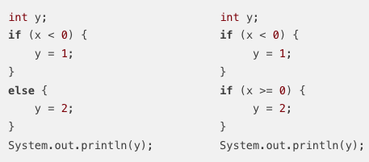
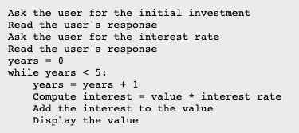

= Chapter 03

== Blocks, Loops, and Branches

=== Blocks

[source]
----
{
    statement
}
----
* 목적
** 여러 statement를 하나의 unit으로 group화

* Empty Block
** {} 중괄호 내부에 어떤 statement도 존재하지 않는 block

* block의 사용이 강제 되는 부분
** main()과 같은 subroutine을 작성해야할 때

* indentation

컴퓨터가 variable declaration statement를 실행할 때 variable이 value를 가질 수 있게 memory를 할당한다.

[source]
----
{
    int temp;
}
----

identifier에는 "scope"라는 기본 개념이 존재.

scope:: 
identifier가 유효한(사용되는) 부분 +
variable이 block 내부에 선언되어지면 해당 variable의 scope는 해당 block이 된다.

=== Control Abstraction

CPU는 간단한 기계어 명령어만 실행할 수 있다. +
Loop나 Branches를 CPU가 이해할 수 있도록 program counter를 특정한 위치 address로 변경하는
Jump 기계 명령어나 특정한 조건을 확인한 이후에 선택적으로 jump명령어를 실행하는 조건부 jump명령어를 사용하도록 구현 되어야 함

abstraction::
사용자가 내부에서 어떻게 작동하는지 이해하지 못하더라도 해당 작업을 수행할 수 있게 해줌
* If statement와 While loop는 Control abstraction의 예
* variable은 data abstraction의 예
** variable을 사용함으로써 해당 메모리의 address, data의 크기 등을 이해할 필요없이 사용이 가능

=== Define Assignment

* 프로그램이 실행중일 때 variable의 값이 할당되었는지를 compiler가 확인할 수 있어야 사용이 가능함.
* 내가 값이 할당 된다고 생각해도 내 입장이 아닌 compiler의 입장에서 생각해야함.

1번 코드는 println subroutine을 실행할 때 오류가 발생하지 않지만 2번 코드는 오류가 발생 +
-> 2번 코드에서는 variable y가 할당을 받았는지 아닌지 확인할 수 없음.

== Algorithm Development

Algorithm::
아이디어를 작업 수행을 위한 완전하고 명확한 단계별 절차로 구체화 하는것.

StepWise refinement::
하향식 설계의 일종. +
1. 특정한 작업에 대해서 설명을 작성하고 해당 설명을 알고리즘의 초안으로 한다.
2. 프로그래밍 언어로 직접 변환될 수 있는 알고리즘이 될 정도로 단계와 추가적인 설명을 작성한다.

Pseudocode::
실제 프로그램의 detail이나 완벽한 syntax는 없으나 프로그래밍 언어의 구조를 모방.

Debugging::
bug를 찾아낸 후 코드의 어느 부분에서 오류가 발생했는지 찾아내는 과정
* breakpoint를 설정해서 해당 시점의 variable data를 확인할 수 있음

Debugging statement::
[source]
----
System.out.println("At start of the while loop, N = " + N);
----

== The while and do..while Statements

[source]
----
while (boolean-expression){
    statement
}
----

* boolean-expression -> continuation condition(연속 조건)
* statement -> body of the loop

sentinel value::
data의 끝을 표현하기 위한 value
-> loop의 종료를 확인할 수 있는 value

priming the loop::
loop가 시작되기 전에 data를 먼저 읽어 오는것

[source]
----
do {
    statement
} while (boolean-expression); //세미콜론 주의
----

flag, flag variable::
subroutine이나 statement의 흐름을 제어할 수 있다. +
variable의 값이 변경되기 전까지 일정한 값을 가지고 변경되었을 때 해당 loop를 종료할 수 있다.

loop label: while::
각 loop 별로 label을 설정해서
[source]
----
    break label;
----
로 해당 loop를 탈출할 수 있음

=== for statement

* while문과 다르게 initialization, continuation condition, updating을 첫 번째 줄에 결합해서
loop control에 관한 내용을 한 장소에 배치해서 쉽게 읽고 이해할 수 있게함.

loop control variable::
for문에서 초기화, 조건, 갱신에 사용되는 변수

off-by-one error::
프로그램에서 1이 차이나는 오류

=== Switch

* switch문에서 expression이 enum type일 때 이미 컴퓨터는 case label의 값이 enum에 포함된다는것을 알고 있기 때문에
enum.variable이 아닌 variable로 사용

=== exception

* java에서 exception은 object로 표현됨
* exception의 sub class

throw ::
exception이 발생할 때 특정 Exception object를 throw한다고 표현

try catch::
throw된 exception을 catch
[source]
----
try{
    statement
}
catch (exception-class-name variable-name) {
    statement
}
----
exception을 catch하면 try문의 실행을 중단하고 catch문장을 실행

=== Arrays
primitive type의 목록

== QUIZ

=== Question 1: What is an algorithm?

어떤 subroutine이 실제로 실행될 수 있도록 단계를 거쳐서 설계하는 과정

=== Question 2: Explain briefly what is meant by "pseudocode" and how is it useful in the development of algorithms.

실제로 실행되지 않지만 프로그래밍 언어의 구조와 유사한 코드. +

=== Question 3: What is a block statement? How are block statements used in Java programs?

특정한 statement를 하나의 unit으로 묶어줌.
어떤 subroutine이나 variable의 scope를 지정함

=== Question 4: What is the main difference between a while loop and a do..while loop?

while은 조건이 false면 아예 실행하지 않지만 do-while은 한번은 실행하고 그 이후에 더 반복할지 조건을 확인한다.

=== Question 5: What does it mean to prime a loop?

loop안의 statement가 제대로 실행될 수 있도록 loop 가 실행 되기 전에 미리 variable에 값을 지정해주는 과정

=== Question 6: Explain what is meant by an animation and how a computer displays an animation.

=== Question 7: Write a for loop that will print out all the multiples of 3 from 3 to 36, that is: 3 6 9 12 15 18 21 24 27 30 33 36.

[source, java]
----
public class Main{
    public static void main(String[] args) {
        for(int i = 3; i <=36; i += 3) {
            System.out.print(i + " ");
        }
    }
}
----

=== Question 8: Fill in the following main() routine so that it will ask the user to enter an integer, read the user's response, and tell the user whether the number entered is even or odd. (You can use TextIO.getInt() to read the integer. Recall that an integer n is even if n % 2 == 0.)
[source, java]
----
public static void main(String[] args) {
    int number;
    Scanner scanner = new Scanner(System.in);

    number = scanner.nextInt();
    if(number % 2 == 0) {
        System.out.println("Even!");
    }
    else {
        System.out.println("Odd!");
    }
}
----

=== Question 9: Write a code segment that will print out two different random integers selected from the range 1 to 10. All possible outputs should have the same probability. Hint: You can easily select two random numbers, but you have to account for the fact that the two numbers that you pick might be the same.

[source, java]
----
public class Main {
    public static void main(String[] args) {
        int number1, number2;

        while (true) {
            number1 = (int) (Math.random() * 10) + 1;
            number2 = (int) (Math.random() * 10) + 1;

            if (number1 == number2) {
                System.out.println("두 정수가 같습니다. 다시 시도합니다." + number1 + " " + number2);
            } else {
                break;
            }
        }

        System.out.println("Number 1 : " + number1);
        System.out.println("Number 2 : " + number2);

    }
}
----

=== Question 10: Suppose that s1 and s2 are variables of type String, whose values are expected to be string representations of values of type int. Write a code segment that will compute and print the integer sum of those values, or will print an error message if the values cannot successfully be converted into integers. (Use a try..catch statement.)

[source, java]
----
import java.util.Scanner;

public class Main {
    public static void main(String[] args) {
        Scanner scanner = new Scanner(System.in);
        String s1, s2;
        int number1, number2;

        System.out.print("Enter a number1: ");
        s1 = scanner.nextLine();
        System.out.print("Enter a number2: ");
        s2 = scanner.nextLine();

        try{
            number1 = Integer.parseInt(s1);
            number2 = Integer.parseInt(s2);
        } catch (NumberFormatException exception) {
            exception.printStackTrace();
        }
    }
}
----

=== Question 11: Show the exact output that would be produced by the following main() routine:
[source, java]
----
public static void main(String[] args) {
    int N;
    N = 1;
    while (N <= 32) {
        N = 2 * N;
        System.out.println(N);
    }
}
----
2
4
8
16
32

=== Question 12: Show the exact output produced by the following main() routine:
[source, java]
----
public static void main(String[] args) {
    int x,y;
    x = 5;
    y = 1;
    while (x > 0) {
        x = x - 1;
        y = y * x;
        System.out.println(y);
    }
}
----
4
12
24
24
0

=== Question 13: What output is produced by the following program segment? Why? (Recall that name.charAt(i) is the i-th character in the string, name.)
[source, java]
----
String name;
int i;
boolean startWord;

name = "Richard M. Nixon";
startWord = true;
for (i = 0; i < name.length(); i++) {
    if (startWord)
        System.out.println(name.charAt(i));
    if (name.charAt(i) == ' ')
        startWord = true;
    else
        startWord = false;
}
----
RMN
' '가 나올때마다 startWord의 value는 true이기 때문에 공백 이후 다음글자를 출력한 이후 다시 startWord의 value가 false가 되기 때문에 공백 이후 첫 단어만 출력이 된다.

=== Question 14: Suppose that numbers is an array of type int[]. Write a code segment that will count and output the number of times that the number 42 occurs in the array.
[source, java]
----
        int count = 0;

        for(int i = 0; i < numbers.length; i++) {
            if(numbers[i] == 42) {
                count++;
            }
        }

        System.out.println(count);
----

=== Question 15: Define the range of an array of numbers to be the maximum value in the array minus the minimum value. Suppose that raceTimes is an array of type double[]. Write a code segment that will find and print the range of raceTimes.
[source, java]
----
int max, min;
int range;

max = raceTime[0];
min = raceTime[0];

for(int i = 1; i < raceTime.length; i++) {
    if(max < raceTime[i]) {
        max = raceTime[i];
    }
    if(min > raceTime[i]) {
        min = raceTime[i];
    }
}

range = max - min;

System.out.println(range);
----