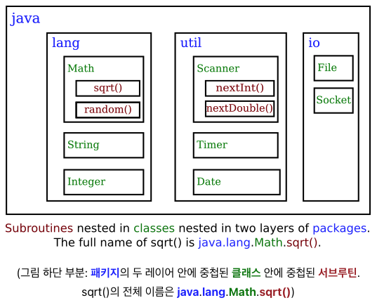

= **Chapter4**

== **Black Boxes and Procedural Abstraction**

규칙 1::
블랙박스의 인터페이스는 매우 간단하고, 명확하며, 이해하기 쉬워야 한다.

규칙 2::
블랙박스를 사용하기 위해 implementation이 어떻게 되어 있는지는 알 필요가 없다. 사용자가 알아야하는것은 인터페이스이다.
* 텔레비전(블랙박스)이 실제로 어떻게 작동하는지 이해하지 못해도 리모컨(인터페이스)을 통해서 전원을 켤 수 있고 채널을 변경할 수 있다.
* 사용자가 알지 못하는 블랙박스의 내부를 implementation(구현)이라고 한다.
* subroutine을 사용하는 프로그램에 영향을 미치지 않고 subroutine의 내부를 수정할 수 있어야한다.

규칙 3::
블랙박스 구현자는 블랙박스가 사용될 시스템에 대해서 알 필요가 없다.
* 구현자는 해당 블랙박스가 작업을 잘 수행하는지만 확인하면 된다.

블랙박스는 내부와 외부를 나누고 인터페이스는 그 경계에서 두 부분을 연결한다.

* 단순히 연결만 하는게 아니라 인터페이스의 요소를 이용하여 블랙박스를 어떻게 제어하는지에 대한 명세가 포함된다.
* subroutine의 인터페이스는 syntatic 요소 뿐 아니라 semantic 요소도 가지고 있다.
** syntatic 요소는 서브루틴을 사용하기 위해 필요한 입력을 알려준다.
** semantic 요소는 서브루틴의 동작을 명시한다.
* 서브루틴을 작성할 때 주석들은 syntatic, semantic 요소들을 명확하게 작성해야한다.

== **Static Subroutines and Static Variables**

클래스의 목적은 관련있는 서브루틴과 변수를 그룹화 하는것

* static 서브루틴 : class의 멤버
* non-static 서브루틴 : object의 멤버. 객체가 생성 되어야 사용이 가능하다.

[source]
----
modifiers return-type subroutine-name (parameter-list) {
    statements
}
----

* statement -> subroutine body, black box implementation
* modifier -> ex) public, static
* return type -> subroutine의 반환타입
* parameter list -> 내부에서 사용되도록 외부에서 전달되는 정보, 여러개 일수도 있고 없을수도 있다.

access specifier::
public, private 같은 subroutine이 사용될 수 있는 범위를 지정해준다.
* public, private, default, protected

* static subroutine을 호출하는 방법
[source]
----
class-name.subroutine-name(parameters);
----

Member Variables::
* local variable
* global variable -> member variable, class 내부에 존재하며 어느 subroutine에서도 사용이 가능

== **Parameters**

subroutine의 interface의 일부분

subroutine을 정의할 때 -> formal parameter
[source]
----
static void doTask(int N, double x, boolean test) {

}
----
* 이름
sobroutine을 호출할 때 -> actual parameter, argument
[source]
----
doTask(17, Math.sqrt(z+1), z >= 10);
----
* 값

signature::
서브루틴의 이름, 파라미터의 갯수, 각 매개변수의 type
NOTE:
signature에는 파라미터의 이름은 포함되지 않는다. +
signature에는 서브루틴의 반환 타입은 포함되지 않는다.

overloading::
signature는 다르지만 같은 클래스에 같은 이름의 서브루틴이 존재할 수 있다.

== **Lambda Expression**
일종의 함수 literal
[source]
----
x -> x*x
----

functional interface::
[source]
----
public interface FunctionR2R{
    double valueAt( double x ); 
}
----

functional interface는 람다 expession으로 표현될 수 있는 서브루틴에 대한 템플릿을 제공.
finctional interface의 이름은 type으로 사용

[source]
----
sqr = (double x) -> { return x*x; };
sqr = (x) -> { return x*x; };
sqr = x -> { return x*x; };
sqr = x -> x*x;
sqr = (double fred) -> fred*fred;
sqr = (z) -> z*z;
----
* sqr은 fuction이 아닌 functional interface type의 값(valueAt)
* 사용할때는 sqr.valueAt(...)으로 사용해야함

[source]
----
static FunctionR2R makePowerFunction( int n ) {
   return x -> Math.pow(x,n);
}
----
-> 람다 표현식이 함수의 반환값인 경우

method reference::
[source]
----
x -> math.sqrt(x)
Math::sqrt
----

== **APIs, Pakages, Modules, and JavaDoc**

Toolbox::
블랙박스의 일종으로 프로그래머에게 일정한 인터페이스(toolbox에 어떤 함수가 있는지, 어떤 매개변수를 사용하는지, 어떤 작업을 수행하는지에 대한 내용)를 제공해준다. +
-> API(Application Programming Interface)

* 자바는 플랫폼 독립적인 언어이다
** 자바 인터프리터가 프로그램을 실행하다가 표준 루틴을 호출할 때 인터프리터는 해당 플랫폼에 적합한 구현을 실행한다.

pakage::

자바의 표준 API는 클래스로 그룹화 된다. +
여러 관련이 있는 클래스들을 하나의 패키지로 그룹화가 가능.

[source]
----
import pakage경로;
import java.util.*;
----

* *은 패키지 내부의 모든 클래스와 일치하는 와일드 카드

module::
패키지의 모음 +
모듈 > 패키지 > 클래스 > (변수와 메소드) 
* 더 나은 접근 제어를 제공하기 위해 도입
* 모든 표준 클래스를 포함하는 JRE(java runtime environment)의 크기 때문에 도입.

모듈 내부에 존재하는 패키지를 export해서 모듈 외부의 다른 클래스가 해당 패키지를 사용할 수 있도록 할 수 있다.

JavaDoc::
[source]
----
/**
 *
 */
----
자바독은 설명이 필요한 메소드, 서브루틴, 클래스의 바로 앞에 등장한다.

* 자바독에는 HTML 마크업 명령을 포함할 수 있다.
* 또한 doc tag를 포함할 수 있다.
** @author -> 클래스에만 사용 가능, 작성자의 이름
** @param
** @return
** @throws

[source]
----
/**
 * @param parameter-name description-of-parameter
 * @return description-of-return-value
 * @throws exception-class-anme description-of-exception
 */
----

javadoc 툴을 이용해서 웹 페이지 문서를 생성할 수 있다. 

== **Program Design**

bottom::
pseudocode 알고리즘의 보완을 멈추고 적절한 프로그램 코드로 변환하는 지점

전체적인 코드를 작성할 때 어떤 특정한 일을 하나의 서브루틴으로 미리 작성을 해두고 이후에 해당 서브루틴을 구현한다면 top-down 방식에 down-top적인 요소를 추가할 수 있다.

Precondition::
서브루틴이 호출될 때 서브루틴이 올바르게 작동하기 위한 조건

* precondition은 서브루틴의 호출자의 의무를 나타냄. 반드시 지켜야 할 조건?
* 매개변수 값의 제한, 해당 서브루틴을 사용하기 위한 프로그램의 상태

NOTE: Math.sqrt(x)의 경우 x는 반드시 0보다 크거나 같아야한다.

Postcondition::
* 서브루틴의 의무를 나타냄.
* 서브루틴이 수행하는 작업.

NOTE: Math.sqrt(x)의 precondition이 만족한다면 항상 예측하는 결과가 나와야한다.

Initialization in Declarations::
[source]
----
int count = 0;
----

* 변수 선언과 초기화를 동시에하는 것

Named constants::
final이라는 modifier를 사용하여 해당 변수의 값을 변경하지 못하게 할 수 있다.

* style -> 변수명을 모두 대문자로 작성

hidden::
클래스의 멤버변수가 클래스에 존재하는 서브루틴의 지역변수와 동일한 이름을 가지고 있어 해당 서브루틴에서 직접적으로 사용되지 못하는것
[source]
----
class-name.member-variable-name
----