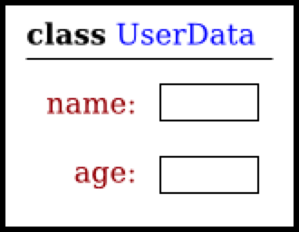
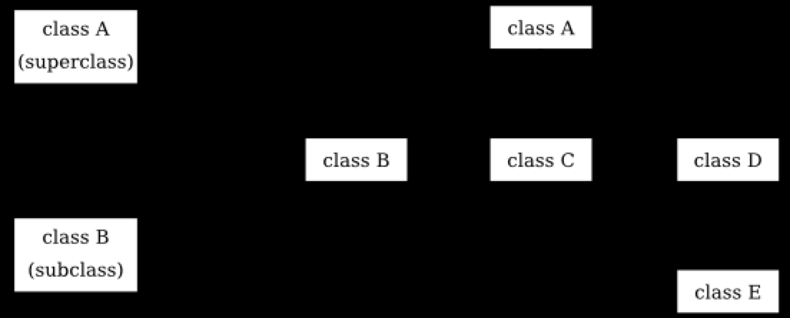
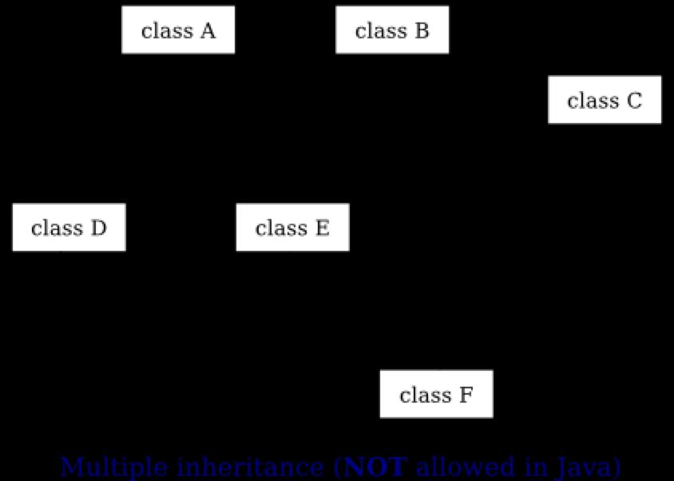

= Chapter5. Programming in the Large II: Objects and Classes

== Section 1. Objects, Instance Methods, and Instance Variables

=== Object-oriented Programming
- 작업 대신 객체(object)
- 객체는 행위를 가지고, 정보를 담고 있으며, 서로 상호작용 할 수 있는 개체(entity)
- `객체(object)` 를 생성하는데 `클래스(class)` 가 사용된다!

_아래와 같이 클래스가 정의되어있다고 가정해보자._
[source,java]
----
class UserData {
    static String name;
    static int age;
}
----
위의 클래스는 다음과 같다고 볼 수 있다.



=== Class
* 클래스를 사용하여 생성된 객체를 해당 클래스의 **__인스턴스(instance)__**라고 한다.
** 객체가 포함하는 변수는 **__인스턴스 변수(instance variable)__**
** 객체가 포함하는 메서드는 **__인스턴스 메서드(instance method)__**
* `static` 으로 선언한 변수, 메서드는 클래스의 일부분
** 해당 클래스의 인스턴스보단 클래스 자체에 속하기 때문에 **__class variable__**, **__class method__**라고 한다.


_학생이라는 클래스 안에서 인스턴스 변수, 메서드를 찾아보자_
[source,java]
----
public class Student {
    public String name;
    public double test1, test2, test3; // 세 가지 시험의 점수

    // 시험 평균을 계산
    public double getAvergave() {
        return (test1 + test2 + test3) / 3;
    }
}
----

> 자바에서 클래스는 `자료형(type)` 임을 잊지 말자. +
> 자바에서 어떠한 변수도 객체를 가질 순 없다. 변수는 오로지 객체에 대한 참조만을 보유할 수 있다. +
> `Student std;` 와 같이 선언한다고 객체가 생성되는 것이 아니라는 뜻!

=== Getter, Setter
- member variable은 private 으로 하고 `getter`, `setter` 로 접근하는 방식을 사용하자


== Section 2. Constructors and Object Initialization


=== Constructor
```java
PairOfDice dice = new PairOfDice();

// new class-name ( parameter-list )
// parameter가 없을 수 있다.
```

- 위와 같이 생성자는 `new` 연산자와 함께 생성된다.
- 이 작업은 **__생성자(constructor)__**라는 메서드를 호출하는 효과
- 시그니처가 다른 생성자를 만들 수 있다.


> 다음과 같이 코드를 작성했을 때 어떤 작업이 일어날까?
```java
Student std = new Student("John Smith");
std = null;
```


== Section 3. Programming with Objects

=== Object class
* 객체 지향 프로그래밍의 주요 특징 중 하나는 클래스의 하위 클래스(subclass)를 생성하는 능력
* 클래스를 만들면서 명시적으로 다른 클래스의 하위 클래스로 하지 않으면, 해당 클래스는 자동으로 `Object` 라는 `java.lang` 패키지에 있는 특수 클래스의 하위 클래스가 된다.

> software life cycle: specification -> analysis -> design -> coding -> testing, debugging -> maintenance +

> 객체 지향 접근 방식: 모든 명사 = 클래스(class), 객체(object) / 모든 동사 = 메서드(method)


== Section 4. Programming Example: Card, Hand, Deck

* 위에서 배웠던 내용을 프로그래밍으로 만들어보는 Session.
* Poker Game을 예시로 진행

== Section 5. Inheritance, Polymorphism, and Abstract Classes

=== Extending Existing Classes

```java
public class subclass-name extends exisiting-class-name {
    .
    . // 변경 및 추가사항.
    .
}
```

* 우리가 만든 포커 게임으로 블랙잭 게임을 만들어보자.

=== Inheritance
* 상속을 하는 클래스는 자신이 상속받는 클래스의 하위 클래스(subclass)라고 한다.
* 아래의 사진과 같이 상속하는 클래스는 superclass, 상속을 받는 클래스는 subclass
```java
class B extends A {
    .
    .
    .
}
```



* Class B, C, D는 형제 클래스
* Class E는 A를 직접적으로 상속하지는 않지만 클래스 A의 subclass로 간주된다.

=== Polymorphism
* Shape -> Rectangle, Oval, RoundRect가 될 수 있음.
* 아래의 코드를 보면서 생각해보기

[source, java]
----
class Shape {
    Color color;

    void setColor(Color newColor) {
        // shape의 색을 바꾸는 메서드
        color = newColor;
        redraw();
    }

    void redraw() {
        // shape을 그리는 메서드
        ? ? ? .. // 어떤 명령이 이 부분에 들어와야 할까?
    }
}

class Rectangle extends Shape {
    void redraw() {
        . . .
    }
}

class RoundRect extends Shape {
    void redraw() {
        . . .
    }
}

class Oval extends Shape {
    void redraw() {
        . . .
    }
}
----

* 위의 클래스들로 생성된 모든 객체는 `someShape.redraw();` 가 가능할 것이다.
* 이렇듯 객체의 유형에 따라 달라지는 메서드를 `다형성(Polymorphism)` 이라고 한다.


=== Abstract classes
* 추상 클래스는 추상 메서드를 선언해놓고 상속을 받은 subclass에서 해당 메서드를 구현(implementation)하도록 유도하는 클래스.
* 추상 클래스를 상속받는 subclass들은 abstract method를 무조건 구현을 해야 한다

_위에서 작성했던 Shape을 추상 클래스로 만들어보자._

```java
public abstract class Shape {
    Color color;

    void setColor(Color new Color) {
        color = newColor;
        redraw();
    }

    abstract voi redraw();
}
```

== Section 6. this and super

=== this
* this는 말 그대로 this object를 가리키기 위한 것

_아래와 같은 상황에서 주로 사용된다._
```java
public class Student {
    private String name;

    public Student(String name) {
        this.name = name;
    }
}
```

=== super
* subclass에서 사용
* superclass에 접근할 때 사용한다.
* super() -> super의 생성자를 호출


== Section 7. Interfaces


* 자바에서는 위와 같이 다중 상속을 허용하지 않음.
* extends는 한 가지의 클래스만 가능!
* 이러한 문제점을 해결하기 위해서 나온 것이 `인터페이스(interface)`!
* interface를 상속받기 위해서는 `implement`

_아래의 예시를 보자._

[source,java]
----
public interface Strokeable {
    public void stroke(GraphicsContext g);
}

public class Line implements Strokeable {
    public void stroke(GhrapicsContext g) {
        . . .
    }
}
----

* 다중 상속도 가능하기 때문에 여러 개를 implements 할 수 있음.
* 변수를 선언할 수 있는데 선언된 변수는 자동적으로 `public static final` 를 선언한 것 같은 효과를 가짐

=== Default Method
* inteface에서도 class처럼 미리 메서드를 구현할 수 있음.

[source,java]
----
public interface Readable {
    public char readChar();

    default public String readLine() {
        StringBuilder line = new StringBuilder();
        char ch = readChar();
        while (ch != '\n') {
            line.append(ch);
            ch = readChar();
        }
    }
}
----

* 다음과 같이 메서드 맨 앞에 **__default__**를 적어주는 방식!

> Interface With Default Methods vs Abstract Class

== Section 8. Nested Classes

=== Inner Classes
* inner class에는 static, non-static이 존재
* static inner calss
** 정적이라는 수식어를 갖는 것을 제외하고는 다른 클래스의 정의와 동일하다.
** static의 특징에 따라 외부 인스턴스 멤버의 직접 참조가 불가능
** 클래스 자체의 일부

[source,java]
----
public class WireFrameModel {
    . . .
    static public class Line {
        double x1, y1, z1;
        double x2, y2, z2;
    }
    . . .
}

/*
    위에서 Line 클래스를 생성하려면 아래와 같이 선언해야 한다.
    "new WireFrameModel.Line()"
    클래스 파일 명은 "WireFrameModel$Line.class"와 같이 생성
 */
----

* non-static inner class
** inner class라고 하며 외부 인스턴스에 대한 참조가 가능
** 외부에 대한 참조가 유지되므로 내부 클래스도 외부 클래스의 자원을 사용할 수 있다.
[source,java]
----
public class PokerGame {
    class Player {
        .
        .
    }

    private Deck deck;
    private int pot;
    ...
}
----


=== Anonymous Inner Class
* 런타임에 해당 클래스에 속하는 객체를 만든다.
* 익명 클래스는 클래스가 아닌 주로 인터페이스를 사용한다.

```java
new superclass-or-inteface ( parameterlist ) {
    method-and-variables
}
```

```java
public interface Drawable {
    public void draw(GraphicsContext g);
}

//-> Annonymous Inner Class로 하면?

Drawable redSqaure = new Drawable() {
    @Override
    public void draw(GraphicsContext g) {
            g.setFill(Color.RED);
            g.fillRect(10, 10, 100, 100);
        }
    };
```

