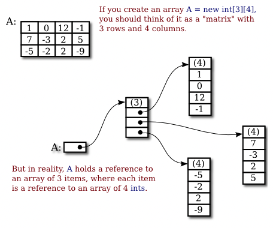

= Chapter7

== **Array**
번호가 매겨진 element의 sequence +
배열을 생성하면 길이를 변경할 수 없다. +
배열의 범위를 벗어난 index에 접근할 때 ArrayIndexOutOfBoundsException 발생.

for-each loops::
[source]
----
for(int i = 0; i < namelist.length; i++) {
    System.out.println( namelist[i] );
}

for(String name : namelist) {
    System.out.println( name );
}
----
*  두 for문은 같은 동작을 한다.
* for-each문을 사용한다면 데이터 구조에 대한 세부사항을 알지 못하더라도 값을 처리할 수 있다.
* 배열에서 값을 하나씩 읽어서 name이란 변수에 값을 저장하므로 name 변수의 값을 변경하더라도 namelist 배열의 값을 변경하지 못한다.

Variable Arity Mehtods::
[source]
----
public static double average( double... numbers ) { 
----

NOTE: variable arity method 를 사용할 때 만드시 매개변수의 마지막 자리로 고정된다.

[source]
----
public static void printNumbers(double value, int... numbers) {

}   //variable arity method가 파라미터의 맨 뒤에 위치하므로 가능.

public static void printNumbers(int... numbers, double value) {

} // 이렇게는 못씁니다.
----

== **Array Processing**

Arrays.copyof(array, size);
-> 배열 array를 size만큼 복사

* 만약 size가 array.length보다 크다면 나머지 공백들은 초기값으로 설정된다.

int [] B = A.clone();
-> 배열 A의 복사본을 생성해서 B에게 해당 reference를 저장한다.

Arrays.fill(array, value);
-> array 배열의 모든 항목을 value로 채운다.

== **Wrapper class**
* primitive type의 값을 개체로 나타내게 해준다.

autoboxing::
primitive type을 자동으로 wrapper class로 래핑하는 것.
[source]
----
Integer answer = 42;

Integer answer = Integer.valueof(42);
----

== **Records**
[source]
----
public record FullName(String firstName, String lastName) {}

FullName fname = new FullName("Jane", "Doe");

public final class FullName {
    private final String firstName;
    private final String lastName;

    public FullName(String firstName, String lastName) {
        this.firstName = firstName;
        this.lastName = lastName;
    }

    public firstName() {
        return firstName;
    }

    public lastName() {
        return lastName;
    }

    public String toString() {
        return "FullName[firstName=" + firstName + ", lastName = " + lastName + "]";
    }

    public boolean equals(Object obj) {
        // (definition omitted)
    }

    publicint hashCode() {
        // (definition omitted)
    }
}
----
* record class는 자동으로 final이다.
* record class의 getter는 인스턴스 변수 이름과 동일하다.
* 인스턴스 변수가 final로 불변으므로 setter를 정의할 수 없다.

record class가 final이어야 하는 이유?
최적화와 관련이 있다.

* 컴파일러가 프로그램을 실행할 때 새로운 객체를 생성해야하는 명령문을 실행해야할 때 해당 객체가 불변이라면 객체를 생성하는 대신에 임시 지역 변수를 사용하여 동일한 작업을 수행한다. 

== **Searching and Sorting**
* searching : 조건을 충족하는 배열의 요소를 찾는 것
* sorting : 특정한 조건으로 요소들을 재배열 하는 것

* linear search (선형 검색) : 각 요소를 차례대로 확인하는 검색 방법.
[source]
----
/**
 * 배열의 처음부터 확인하면서 검색하고자 하는 정수 N의 index를 return하는 메소드.
 * 배열에 검색한 요소가 존재하지 않으면 -1을 return
 */
static int fint(int[] A, int N) {
    for(int index = 0; index < A.length; index++) {
        if(A[index] == N) {
            return index;
        }
    }

    return -1;
}
----
* binary search (이진 검색) : 정렬된 배열에서 특정 요소를 검색하는 방법.
[source]
----
/**
 * 정렬되어 있는 배열에서 이진 검색을 수행하는 메소드
 * 배열 A는 오름차순으로 정렬되어 있어야 한다.
 * N이 배열에 존재하지 않으면 -1을 반환한다.
 */
static int binarySearch(int[] A, int N) {
    int lowerPossibleLoc = 0;
    int highestPossibleLoc = A.length -1;

    while(highestPossibleLoc >= lowerPossibleLoc) {
        int middle = (highestPossibleLoc = lowerPossibleLoc) / 2;

        if(N > middle) {
            lowerPossibleLoc = middle + 1;
        } else if (N < middle){
            highestPossibleLoc = middle -1;
        } else {
            return middle;
        }
    }

    return -1;
}
----

association list::
(key, value)의 형식으로 이루어진 list
* get -> key를 가지고 value를 찾는 메소드
* put -> key와 value를 추가하는 메소드

[source]
----
/**
 * key : name
 * value : phoneNumber
 */
class PhoneEntry{
    String name;
    String phoneNumber;
}
----

* Insertion Sort (삽입 정렬) : 정렬을 유지하면서 요소를 추가하는 정렬 방법

* Selection Sort (선택 정렬) : 배열에서 가장 큰 요소를 찾아서 배열의 끝에 채우면서 정렬 시키는 방법

== **Two-dimensional Array**
[source]
----
int[][] A;
A = new int[3][4];
----

* 2차원 배열을 구현하기 위해서 각 배열에 다른 배열을 reference를 가지고 있는 형태.