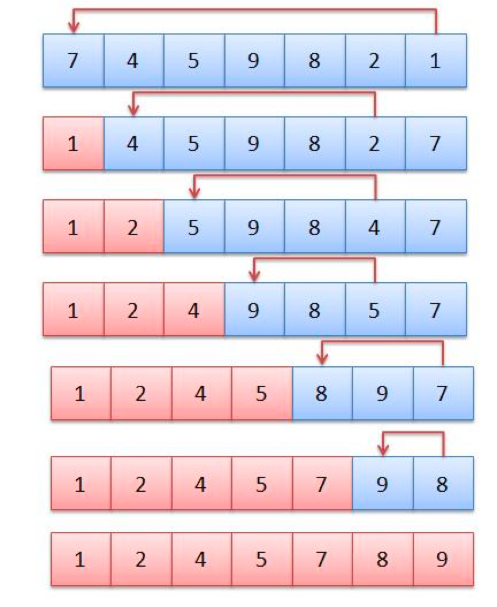

= Chapter 7. Arrays, ArrayLists, and Records

== Section 1. Array Details
* 배열(Array) : 원소들의 번호가 매겨진 시퀀스
** 각 원소는 별개의 변수처럼 작용
** 원소들은 모두 같은 타입

=== For-each Loops

[source,java]
----
String[] namelist = new String[10];

for (String name : namelist) {
    System.out.println(name);
}
----
* 위의 코드를 실행한다면 namelist 배열 안에 있는 값들이 차례대로 출력된다.
* 배열의 인덱스를 지정하지 않아도 값을 가져올 수 있다는 장점이 존재
* 배열을 순차적으로 접근한다는 점을 고려하며 사용하자

[source,java]
----
int[] intList = new int[10];
for (int item : intList) {
    item = 17; // 이렇게 값을 할당하는 것은 불가능!!!
}
----

=== Variable Arity Methods(...)
* 기존 자바에서는 airity(메서드에서 호출할 때 요구하는 매개변수의 개수)는 고정적이었다.
* Java 5 이후로 variable airty method를 도입하면서 매개변수의 개수를 가변적으로 설정할 수 있게 됨

_아래는 Variable Arity Method의 예시이다._
```java
public static double average(double... numbers) { }
```

* 위의 코드에서 formal parameter는 array와 같이 사용할 수 있다.
* 즉, numbers.length를 사용하여 인덱스를 접근할 수 있다

=== Array Literals
```java
// 배열을 선언과 동시에 값을 초기화하려면 다음과 같이 선언하면 된다.
int[] squares = { 1, 4, 9, 16, 25, 36, 49 };
```

== Section 2. Array Processing

=== Array Methods
* 아래와 같은 메서드를 활용하여 배열을 복사할 수 있다.
```java
Arrays.copyOf( list, lengthOfCopy );

// or
int[] B = A.clone();
```

* Arrays Class의 메서드
** Arrays.fill(array, value) -> array의 모든 요소가 value를 갖도록 설정
** Arrays.fill(array, fromIndex, toIndex, valu) -> array에서 fronIndex ~ toIndex - 1까지의 요소를 value로 변경
** Arrays.toString(array) -> array의 모든 값을 포함하는 문자열을 반환
** Arrays.sort(array) -> array의 값을 오름차순으로 정렬
** Arrays.sort(array, fromIndex, toIndex)
** Arrays.binarySearch(array, value) -> 오름차순으로 정렬되어있는 array가 들어와야하며, 해당 배열에서 값을 찾는 메서드이다. 반환 값은 해당 값을 포함하는 요소의 인덱스이거나 찾지 못할 경우 -1을 반환한다.

== Section 3. ArrayList

=== ArrayList
* 동적 배열을 나타내는데 사용할 수 있다.
* primitive type이 올 수는 없다. (`ArryaList<T>`)

* ArrayList의 메서드
** list.size() -> list의 현재 크기를 반환
** list.add(obj) -> list 끝에 obj를 추가하고 크기를 1씩 늘린다.
** list.get(index) -> list에서 index 위치에 저장된 값을 반환, IndexOutOfBoundsException이 발생할 수 있다.
** list.set(index, obj) -> list에서 index 위치에 저장된 값을 obj로 변경
** list.clear() -> list의 모든 항목을 삭제하고 size를 0으로 만든다.
** list.remove(index) -> list에서 index 위치에 있는 값을 삭제하고 크기를 1씩 감소시킨다.
** list.remove(obj) -> list 안에 obj가 존재하면 첫 번째의 obj가 삭제된다. boolean type을 return
** list.indexOf(obj) -> list에서 obj가 위치한 index를 반환, 여러 개일 경우 첫 번째의 위치를 반환하며 존재하지 않으면 -1

=== Wrapper Class
* primitive type이 아닌 객체
* Integer type의 객체는 int 유형의 인스턴스 변수가 포함되어있음.
* 즉, int 값의 wrapper
* In Java, all `primitive wrapper classes` (Byte, Short, Integer, Long, Float, Double, Character and Boolean) are immutable.
* *autoboxing* -> Integer 유형의 객체가 필요한 Context에서 int 유형의 값을 넣어도 자동으로 Integer Object로 wrapping이 된다.

== Section 4. Records
* C언어에서의 "struct"와 동일한 개념
* 자바에서 Records는 불변이기 때문에 생성된 후에 해당 내용을 수정할 수 없음.
* 인스턴스 변수는 선언할 수 없다. 그러나 static 변수는 생성이 가능
* 다른 클래스를 상속받을 수 없지만, 인터페이스로 구현이 가능
_아래는 Record를 선언하는 간단한 예시이다._
```java
public record FullName(String firstName, String lastName) { }

// 위의 코드는 아래의 코드랑 동일한 구조를 가진다.
        public final class FullName {
            private final String firstName;
            private final String lastName;

            FullName(String firstName, String lastName) {
                this.firstName = firstName;
                this.lastName = lastName;
            }

            public String firstName() {
                return firstName;
            }

            public String lastName() {
                return lastName;
            }

            @Override
            public boolean equals(Object obj) {
                ...

            }

            @Override
            public int hashCode() {
                ...
            }

            @Override
            public String toString() {
                return "FullName[" +
                        "firstName=" + firstName + ", " +
                        "lastName=" + lastName + ']';
            }

```


== Section 5. Searching and Sorting

=== Searching

==== Linear Search
* 각 항목을 차례대로 살펴보면서 찾는 방식
* 배열에서 for문을 돌려 값을 찾는 것

==== Binary Search

image::https://upload.wikimedia.org/wikipedia/commons/thumb/8/83/Binary_Search_Depiction.svg/2880px-Binary_Search_Depiction.svg.png[binarySearch]

==== Association Lists
* list를 사용해서 탐색을 할 수 있다.
* (key, value) 한 쌍을 가지는 클래스를 선언하고 그 클래스를 List의 type으로 사용하면 검색하기에 용이하다.
* 위에 설명한 것을 구현한 것이 Map이라는 자료형이다.

=== Sorting
==== Insertion sort
image::https://math.hws.edu/javanotes/c7/insertion-sort.png[insertion sort]


==== Selection Sort



== Section 6. Two-dimensional Arrays
* 자바에서 2차원 배열은 모두 1차원 배열로 구현되어있는 것이다.
