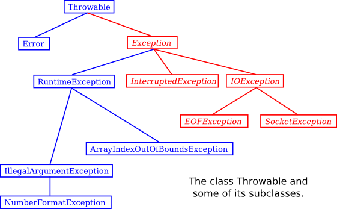

= Chapter 8 Correctness, Robustness, Efficiency

== Section 1: Introduction to Correctness and Robustness
- A PROGRAM is correct if it accomplishes the task that it was designed to perform.
- It is robust if it can handle illegal inputs and other unexpected situations in a reasonable way.
- 필수 도서 : Computer Ethics by Tom Forester and Perry Morrison

- 자바 외의 프로그래밍 언어에서 발생하는 에러의 종류 :
- 자바는 exception을 통해 에러를 처리.
** 변수의 type을 지정하지 않고 변수 선언이 가능한 경우 오타에 의해 오류가 발생할 수 있음
** 배열의 크기보다 크거나 작은 주소에 값을 쓸 경우 자바에서는 이를 탐지하고 Exeption을 던지지만 다른 언어에서는 아무 상관없이 값을 쓸 수 있다.
** 포인터 값이 잘못된 유형의 개체를 가리키거나 유효한 개체를 전혀 보유하지도 않는 메모리 세그먼트를 가리키고 있을 때 발생
** nullpoint 오류. 
** memory leak 자바 외의 다른 프로그램들은 사용하지 않는 메모리들을 반환하지 않으면 프로그램과 데이터에 사용할 메모리가 줄어들 수 있다.
** buffer overflow

* Java에 남아있는 문제 :
** int overflow
** double overflow. Double.Positive_INFINITY, Double.Negative_INFINITY, Double.Nan.
*** 0을 0으로 나누거나 음수의 제곱근을 취한 결과는 Double.NaN이다.

* Robustness 하게 코드를 작성하는 technique을 배워야 한다.

== Section 2: Writing Correct Programs

* The fundamental ideas are process and state
** A state consists of all the information relevant to the execution of a program at a given moment during its execution
*** state는 프로그램의 모든 변수 값, 생성된 출력, 읽기 대기 중인 입력, 컴퓨터가 작동하는 프로그램의 위치 기록 등을 포함한다.
** A process is the sequence of states that the computer goes through as it executes the program

* Precondition, Postcondition
** Precondition : A precondition is defined to be a condition that must be true at a given point in the execution of a program in order for the program to continue correctly.
** Postcondition : A fact that can be proven to be true after a given program segment has been executed

* Invariants
* loop invariants는 procondition이자 postcondition이다.
* class invariants는 클래스의 상태 또는 해당 클래스에서 생성된 개체에 대해 항상 참인 statement.
** 일반적으로 class invariants는 모든 생성자의 postcondition이며, class의 모든 method의 precondition이자 postcondition이라고 할 수 있다.
** method를 작성할 때 해당 메소드의 코드가 invariants를 충족하는지 확인해야 한다.
** method가 호출되었을 때 class invariants가 참이라고 가정하면 method가 실행된 후에도 class invariants가 참인지 확인해야 한다.

== Section 3: Exceptions and try..catch

* robust program은 비정상적이거나 예외적인 상황에서도 충돌 없이 살아남을 수 있다.
* exception이 발생하면 실제로 throw되는 것은 object이다.
* 이 exception object는 instance variable에 정보를 담을 수 있다. 이 정보에는 항상 예외를 던졌을 때 실행되고 있던 서브루틴의 목록인 subroutine call stack이 포함된다.(한 subroutine이 다른 subroutine을 호출할 수 있으므로 여러 서브루틴이 동시에 활성화될 수 있다.)
* Throwable에는 Error와 Exception이라는 두 개의 직접적인 하위 클래스가 있다.

.Error
* Error class의 하위 클래스 대부분은 Java 가상 시스템 내에서 심각한 오류를 나타내며, 이 오류를 처리할 합리적인 방법이 없기 때문에 일반적으로 프로그램을 종료시킨다.

.Exception
* Exception class의 하위 클래스는 catch되어야 하는 예외를 나타낸다. 
* 프로그래머가 예상할 수 있고 합리적인 방식으로 대응할 수 있는 프로그램의 오류 또는 입력 데이터의 오류이다. 
* 오류에 대응할 합리적인 방법이 없는 경우에는 프로그램이 중단되도록 하는 것이 가장 좋다. 최악의 경우에는 정답이 틀릴 수도 있다는 표시를 하고 오답을 제공하는 프로그램이다.
* Exception class에는 자체 하위 클래스인 Runtime이 있다.

.RuntimeException
* 많은 공통 예외를 그룹화한다.
* 일반적으로 프로그램에 bug가 있음을 나타내며 프로그래머는 이를 수정해야 합니다.
* RuntimeException과 Error는 프로그램이 발생할 수 있는 가능성을 단순히 무시할 수 있다는 속성을 공유한다. (여기서 "무시"는 예외가 발생할 경우 프로그램이 중단되도록 허용하는 것으로 만족함을 의미한다.)

//-

* Error와 RuntimeException 이외의 다른 모든 예외 클래스의 경우, 그리고 그 하위 클래스인 예외 처리는 "필수"이다.
* 아래 그림은 Throwable 클래스와 일부 하위 캘르스를 보여주는 클래스 계층 구조이며, 필수 예외 처리가 필요한 클래스는 빨간색으로 표시된다.

.try-catch-finally
* e가 Throwable인 type일 경우 e.toString() method는 exception이 속한 클래스의 이름뿐만 아니라 e.getMessage()에서 반환되는 문자열을 포함하는 String을 반환한다.
* e.printStackTrace() method는 표준 출력에 stack trace를 기록하여 exception이 발생했을 때 어떤 서브루틴이 활성화되었는지 알려준다. stack trace는 문제의 원인을 파악할 때 매우 유용할 수 있다.
* nullpointerexception이나 arrayindexoutofbounds exception을 try-catch로 처리하는 것보단 주의깊은 프로그래밍이 더 낫다. 
* Exception-handling은 program robustness의 문제점을 해결하지 못한다.
* try-catch statement에서 try는 0개 이상의 catch statement와 final statement를 가질 수 있다. 다만 try를 사용하려면 catch, final 둘 중 하나는 있어야한다.
* finally statement는 예외가 발생하던 안하던 무조건 실행된다.
* finally statement에는 어떤 경우에도 빠져서는 안 되는 필수적인 작업을 위한 것이다. 네트워크 연결을 닫는 작업 등이 있다.

//-

.Throwing Exception
* 프로그램이 예외적이거나 error condition을 발견했지만, 오류를 처리할 합리적인 방법이 없는 경우 프로그램이 의도적으로 예외를 두는 것이 타당할 때가 있다.
* throw exception-object : exception-object는 Throwable의 하위 클래스여야 한다.
* floating-point number를 사용하는 산술 연산에서는 예외가 발생하지 않는다. 대신 Double.NaN이 잘못된 연산의 결과를 나타내는 데 사용된다.
* unwinding the call stack : subroutine에서 throw exception을 했을 때 subroutine을 호출한 어디에서도 exception-handling을 하지 않을 경우 프로그램이 종료되는 현상.

.Mandatory Exception Handling
* checked exception : 의무적으로 처리해야 하는 exception. throws clause에 반드시 써야 한다.
* exception handling의 두 가지 방법 :
** try-catch
** throws
* RuntimeException과 error의 하위 클래스가 아닌 모든 expcetion class에 대한 예외 처리는 필수이다. 이러한 checked exception은 일반적으로 프로그래머의 통제를 벗어나는 조건을 나타낸다.
** ex) 잘못된 입력 또는 사용자의 illegal action

.Programming with Exceptions
* 프로그램에서 예외적인 조건이 발생하여 이를 즉시 처리할 방법이 없는 경우 프로그램은 예외를 던질 수 있다. 
* 그러나 예외 조건을 적절하게 나타내는 표준 클래스가 없는 경우 프로그래머는 새 exception class를 정의할 수 있다. 새 클래스는 Throwable 또는 하위 클래스 중 하나를 extends 해야 한다.
* In general, if the programmer does not want to require mandatory exception handling, the new class will extend RuntimeException (or one of its subclasses). To create a new checked exception class, which does require mandatory handling, the programmer can extend one of the other subclasses of Exception or can extend Exception itself.
* Exception은 예외가 아니닌 interruption을 깔끔하게 다루기 위해 사용될 수 있다.

== Section 4: Assertions and Annotations

.Assertions
* c, c++ 같은 언어에서는 assert 문장을 키고 끌 수 있다.
* 프로그램이 한 방법으로 컴파일 된 경우 assertions는 컴파일 된 코드에 포함되고, 다른 방법으로 컴파일 된 경우 assertions는 포함도지 않는다.
** 예를 들어, 디버깅시에는 assertions가 첫 번째 컴파일 방법을 사용하고, release version에는 두 번째 컴파일 방법을 사용한다.
* Java에서 assertions은 debugging 동안에는 turn on되고, normal execution에는 turn off된다.
* 하지만, Java에서 assertions는 compile time 대신 run time에 turn on, off 된다.
* Java 소스 코드의 어설션은 컴파일된 클래스 파일에 항상 포함된다.
* 프로그램이 정상적인 방식으로 실행되는 경우 assertions는 무시된다. 
* assertions는 bug를 찾고 식별하는데 큰 도움이 된다.
* Java에서 assertion statement

[source, java]
----
assert condition;
assert condition : error-message;
----

* error-message는 String or an expression of type String이다.
* assertion statement는 statement가 유효한 어느 곳에서도 사용할 수 있다.
* assertions가 활성화 되어 있고 assertion의 boolean이 false라면 java.lang.AssertionError exception이 throw된다.
* 만약 assert statement가 error-message를 포함한다면, error message string은 AssertionError의 message가 된다.
[source, java]
----
assert condition : error-message;
----
* 는 아래와 같다.
[source, java]
----

if ( condition == false )
    throw new AssertionError( error-message );
----

* 언제 exception 대신 assertions를 사용할 것인가?
** 보통 프로그램이 올바르게 작성된 경우 assertions를 사용해 반드시 참이 되어야 하는 조건을 테스트 한다.
* assertions는 디거빙을 도와주기 위한 것이고, exception은 코드를 사용하는 사람들이 코드를 잘못 사용하고 있다는 것을 알리기 위한 것이라고 말할 수 있다.
* command-line에서 "-ea:class-name" 형식의 옵션을 사용하면 지정된 클래스의 assertions만 사용할 수 있다.
* "-ea:package-name..."을 사용하면 패키지 및 하위 패키지에서 모든 assertions를 활성화할 수 있다.
* "paintutils"와 "drawing"이라는 패키지의 모든 클래스에 대해 assertions가 활성화된 "MegaPaint"라는 Java 프로그램을 실행하려면 다음 명령을 사용한다.
** -ea:paintutils...  -ea:drawing...  MegaPaint

.Annotation
* annotation은 metadata 또는 metatext이다.
* @Deprecated : 더이상 사용되지 않는 class, method, variable에 써주면 Deprecated annotation이 붙은 item을 사용할 때 컴파일러가 warning을 발생시킨다.
* @SuppressWarnings("deprecation") : parameter로 제공된 warning을 컴파일러가 무시하도록 한다.
* annotation을 새로 정의해서 사용할 수 있다. 표준 컴파일러와 프로그래밍 tool에서는 이러한 annotation을 무시하지만, annotation을 이해하고 소스 코드에 있는지 확인할 수 있는 프로그램을 작성할 수도 있다. 
* runtime에 유지되어 실행 중인 프로그램의 일부가 될 annotation을 작성할 수도 있습니다. 그 경우 프로그램은 실행 중인 실제 컴파일된 코드에서 annotation을 확인하고 annotation의 존재 여부 또는 parameter value에 따라 달라지는 작업을 수행할 수 있다.
* boilerplate : 반복 사용 어구 -> 비슷한, 같은 문장을 반복해서 작성한다는 의미인 듯 하다.
* 예를 들어 프로그램의 프로그램 상태의 특정 측면을 파일에 저장했다가 나중에 복원하는 코드가 있다고 가정해보자. 간단한 예는 프로그램에 해당 기능을 하는 코드를 작성하는 것이다. 모든 relevant state variables의 값을 읽고 쓰는 코드는 매우 반복적이다.
* Instead of writing that code by hand, a programmer could use an annotation to mark the variables that are part of the state that is to be saved. A program could then be used to check for the annotations and generate the save-and-restore code. In fact, it would even be possible to do without that code altogether, if the program checks for the presence of the annotation at run time to decide which variables to save and restore.

== Section 5: Analysis of Algorithms

.Asymptotic Analysis
* Asymptotic이라는 용어는 기본적으로 입력 크기가 증가함에 따라 장기적으로 나타나는 경향을 의미한다.
* 작은 크기의 문제나 실제로 고정된 유한 크기의 문제에 대해 어떤 일이 발생하는지에는 관심이 없습니다. 문제의 규모가 한계 없이 증가함에 따라 장기적으로 일어나는 일만이 중요합니다.

.Big-oh 표기법
* O(f(n)) : 프로그램의 상한선을 나타냄. O(f(n))은 해당 알고리즘의 runtime이 f(n)의 상수 배(n의 큰 값에 대해)보다 크지 않다는 것을 의미한다.
* Ω(f(n)) : 프로그램의 하한선을 나타냄. Ω(f(n))은 해당 알고리즘의 runtime이 어떤 상수 x f(n)(큰 n 값의 경우)보다 크거나 같다는 것을 의미한다. 오메가.
* O(f(n))은 알고리즘이 완료될 때까지 기다려야 할 수 있는 최대 시간에 대해 알려준다. Ω(f(n))은 최소 시간에 대해 알려준다.
* Θ(f(n)) : 알고리즘의 실행 시간이 Ω(f(n))과 O(f(n))인 경우 실행 시간은 * Θ(f(n))라고 한다. 세타. 이는 n의 값이 큰 경우 실행 시간이 a*f(n)과 b*f(n) 사이라는 의미이다.(b>a이고 둘 다 0보다 크다.)
