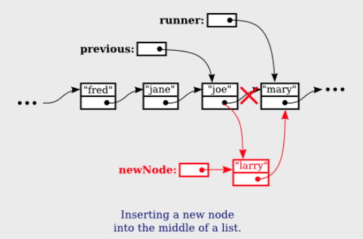
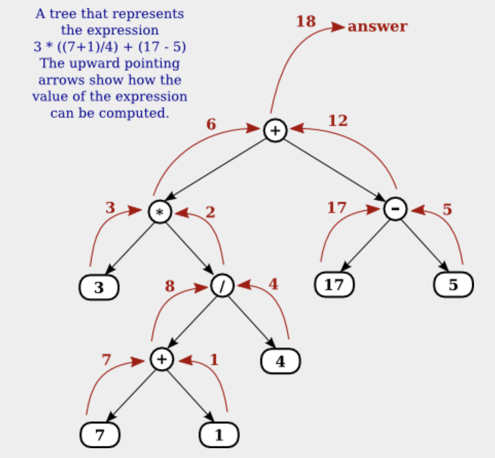

= Chapter. 9 Linked Data Structures and Recursion

== Section 9.1 Recursion

=== 9.1.1 Recursive Binary Search
* recursive algorithm의 base case는 algorithm을 recursive하게 적용하는 것이 아니라 직접적으로 처리되는 case이다.
* recursion이 적절하게 작동되기 위해 참이어야 하는 두 가지 사항
** recursion을 사용하지 않고 다룰 수 있는 한 개 이상의 base case가 있어야 한다.
** subroutine이 recursive하게 적용될 때 원래 문제보다 작은 문제에 적용되어야 한다.

=== 9.1.2 Towers of Hanoi
* recursion을 사용하면 쉽지만 recursion 없이는 해결하기 어려운 문제

=== 9.1.3 Recursive Sorting Algorithm
* quicksort

== Section 9.2 Linked Data Structure

=== 9.2.1 Recursive Linking
* object 안에는 다른 object를 instance variable로 가질 수 있다. 
** ex) Employee type의 emp에 Employee type의 supervisor를 instance variable로 가질 수 있다.

=== 9.2.2 Linked Lists
* node란 linked data structure에서 한 object를 지칭하는데 사용된다.
* 일반적인 연산 : list에서 node 삭제, list에 새로운 node 삽입, list에서 특정한 node 찾기
* head : linked lists의 첫 node를 가리키는 값

=== 9.2.3 Basic Linked List Processing
* tail : head를 뺀 나머지 list들
* Linked Lists를 처리하는, 사용하는 방법들
** while loop, for loop, recursion 등등
*** recursion을 사용하는 방법은 드물지만 recursion을 사용하면 이해하는데 도움이 됨
* 이 섹션에서 항상 강조하는 것은 head == null인지를 항상 고려해야한다는 것이다.

=== 9.2.4 Inserting into a Linked List
* Linked List 중간에 node를 insert 하는 방법

* previous는 runner를 가리키고 있음.

=== 9.2.5 Deleting from a Linked List
* Linked List search, insert, delete 연산 구현하기

== Section 9.3 Stacks, Queues, and ADTs
* ADT : Abstract Data Type, refers to a set of possible values and a set of operations on those values, without any specification of how the values are to be represented or how the operations are to be implemented.
* Abstraction is an important general concept in computer science.

=== 9.3.1 Stacks
* Linked List로 Stack 구현 가능. push, pop 연산마다 head가 가리키는 노드가 달라짐.
* Array로 Stack 구현.
* insert, delete, empty operation.
* push, pop.

=== 9.3.2 Queues
* Linked Lists와 Array로 Queue 구현 가능.
* insert, delete, empty operation.
* enqueue, dequeue
* subroutine이 호출되면, 그 subroutine을 위한 activation record가 생성된다. activation record는 stack에 위치한다.
* activation record는 subroutine을 실행하기 위해 연관된 정보들을 포함한다.
** subroutine의 local variables, parameters, and return address

=== 9.3.3 Postfix Expressions
* stack은 postfix expression에 사용된다.
* infix expression은 2+2처럼 operator가 operands 사이에 있다
* postfix expression은 2 2 + 처럼 2개의 operands 뒤에 operator가 온다.
* postfix expression의 장점 : 괄호가 필요없다.
* postfix expression의 모든 계산이 끝나고 stack에서 pop을 하면 결과 값이 나온다. 만약 pop을 한 뒤에도 stack이 empty하지 않다면 error.
* postfix는 컴퓨터에서 많이 사용되고, JVM은 stack을 기반으로 expression evaluation에 접근하는 "stack-machine"이다.

== Section 9.4 Binary Tree
* parent, children, leaf
* binary tree는 root 노드가 있고, loop를 형성해서는 안된다. 

=== 9.4.1  Tree Traversal
* tree를 구성하는 node를 count 할 때, recursion을 사용하면 쉽다. 반복문을 사용하려면 stack이나 queue같은 data structure가 필요하다.
* tree node count algorithm의 basecase = tree가 비었다면 node의 개수는 0이다.

.Preorder, Postorder, Inorder traversal
* Preorder : root, left subtree, right subtree 순으로 처리
* Postorder : left subtree, right subtree, root 순으로 처리
* Inorder : left subtree, root, right subtree 순으로 처리

=== 9.4.2  Binary Sort Trees
* A binary tree can be used to store an ordered list in a way that makes both searching and insertion efficient.
* BST를 Inorder로 print하면 오름차순으로 출력된다. 이는 definition을 표현하는 또 다른 방법일 뿐이다.
* 즉, BST에서 Preorder는C 노드의 left subtree에 해당하는 노드들은 C보다 먼저 출력되고, C 노드의 right subtree에 해당하는 노드들은 C보다 나중에 출력된다는 것을 보장한다.
* A binary tree is balanced if for each node, the left subtree of that node contains approximately the same number of nodes as the right subtree.
** Random 순서로 insertion했다면, tree는 balanced 할 가능성이 높다.
* Binary Tree가 완벽하게 balanced 하다면, search 과정에서 고려사항이 1/2씩 줄어든다.
* insertion order가 random이라면 insertion의 run time은 평균적으로 Θ(log(n))에 가깝다. 하지만 최악의 경우 Θ(n)일 수 있다.
* binary sort trees의 search operation : root가 null이면 false, root와 subtree들을 타고 내려가면서 해당 노드를 찾으면 성공, null을 만나면 실패
* binary sort trees의 insertion operation : root가 null이면 이제 root는 새 노드가 됨. root의 subtree들을 타고 내려가면서 null을 만나면 거기에 새 노드를 삽입.

=== 9.4.3 Expression Trees
* tree의 또 다른 응용은 15*(x+y) 또는 sqrt(42)+7과 같은 수학적 표현을 편리한 형태로 저장하는 것이다.
* Expression Tree :

* Expression Tree의 leaf 노드는 operand를 담고, operator들을 담은 노드는 operator가 적용되는 operator를 나타내는 subtree가 두 개 있다.
* 루트 노드에 대해 계산된 값은 식 전체의 값이다.
* a postorder traversal of the tree will output the postfix form of the expression.

== Section 9.5 Simple Recursive Descent Parser

=== 9.5.1  Backus-Naur Form
* 프로그래밍 언어의 경우 구문 규칙은 1950년대 후반 컴퓨터 과학자 John Backus와 Peter Naur가 개발한 시스템인 BNF(Backus-Naur Form)로 표현되는 경우가 많다.
* 거의 같은 시기에 언어학자 Noam Chomsky에 의해 자연어의 문법을 기술하기 위한 동등한 시스템이 독자적으로 개발되었다.

.BNF
* BNF는 모든 가능한 syntax rule들을 표현할 수 없었지만, 언어의 기본 구조를 표현하며 컴파일러 설계에 중심적인 역할을 한다.
* BNF에는 다양한 표기법이 사용된다. 
* In BNF, a syntactic category is written as a word enclosed between "<" and ">". 
** For example, <noun>, <verb-phrase>, or <while-loop>.

**<sentence>  ::=  <noun-phrase> <verb-phrase>**
* The symbol "::=" is read "can be", so this rule says that a <sentence> can be a <noun-phrase> followed by a <verb-phrase>.
* Noun-phrase 와 verb-phrase 차례로 다른 BNF 규칙에 의해 정의되어야만 한다.

**<verb-phrase>  ::=  <intransitive-verb>  | ( <transitive-verb> <noun-phrase> )**
* BNF에서, 대안들 중 하나를 고르는 것은 or로 읽히는 "|" 기호로 표현된다.
* For example, the rule says that a <verb-phrase> can be an <intransitive-verb>, or a <transitive-verb> followed by a <noun-phrase>.
* 예를 들어, 이 규칙은 <verb-phrase>는 <intransitive-verb>일 수 있고, a <transitive-verb> followed by a <noun-phrase>일 있다는 뜻이다.
* 괄호는 grouping을 위해 사용될 수 있다.

**<noun-phrase>  ::=  <common-noun> [ "that"<verb-phrase> ]  | <common-noun> [ <prepositional-phrase> ]...**
* Optional을 표현하기 위해 "["와 "]"를 사용한다. 
* "[" 와 "]" 사이에 원하는 만큼 반복된 optional item이 포함되어 있다.
* a <noun-phrase> can be a <common-noun>, optionally followed by the literal word "that" and a <verb-phrase>, or it can be a <common-noun> followed by zero or more <prepositional-phrase>'s

//-

* 진정한 힘은 BNF 규칙이 recursion일 수 있다는 사실에서 비롯된다.
* 언어의 재귀적 구조는 언어의 가장 기본적인 특성 중 하나이며, 이러한 재귀적 구조를 표현하는 BNF의 능력은 언어를 매우 유용하게 만듭니다.

//-

BNF는 형식적이고 정확한 방법으로 자바와 같은 프로그래밍 언어의 구문을 설명하는 데 사용될 수 있다.

* while loop는 다음과 같이 정의될 수 있다.
** <while-loop>  ::=  "while" "(" <condition> ")" <statement>

=== 9.5.2  Recursive Descent Parsing
* recursive descent parsing : 유일하거나 가장 효율적인 방법은 아니지만, 직접 컴파일러를 작성하는 데 가장 적합한 방법이다.
* recursive descent parser에서 BNF 문법의 모든 규칙은 서브루틴의 모델이다.

=== 9.5.3  Building an Expression Tree
