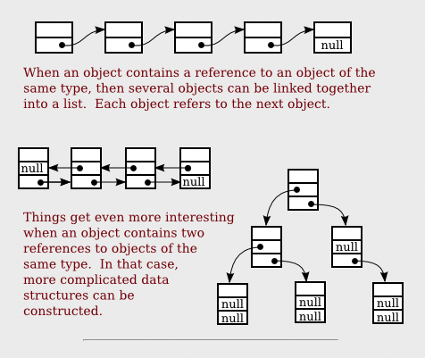
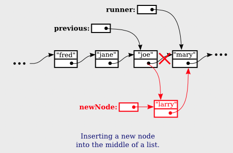
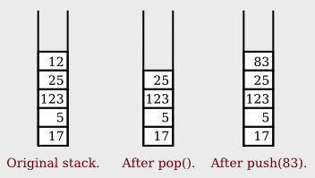
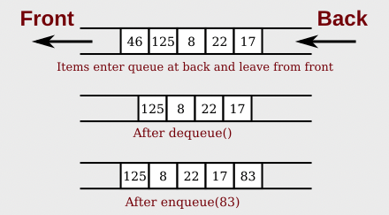

= Chapter 9

== **Recursive Binary Search**
base case::
직접 해결할 수 있는 수준의 case. +
recursive를 끝내기 위한 조건

* recursive subroutine의 2가지 규칙
1. 하나 이상의 base case가 존재해야 한다. (intinite recursion)
2. 원래 문제보다 작은 문제에 적용해야 한다.

== **recursive linking**

[source]
----
//Node는 data와 다음 node에 대한 포인터를 가진다.
class Node {
    String item;
    Node next;
}
----

첫 번째 node의 포인터를 가진 head 변수가 필요하다.

[source]
----
// 노드의 모든 data를 출력하는 방법
Node runner = head;
while (runner != null) {
    System.out.println(runner.item);
    runner = runner.next;
}
----

[source]
----
// node의 모든 값을 더하는 메서드 (recursive)
public static int addItemsInList(IntNode head) {
    if(head == null) {
        return 0;
    }

    int listsum = head.item;
    int tailsum = addItemsInList(head.next);
    listsum = listsum + tailsum;
    return listsum;
}
----

[source]
----
public void insert(String insertItem) {
    Node newNode = new Node();
    newNode.item = insertItem;

    if(head == null) {
        head = newNode;
    }
    else if(head.item.compareTo(insertItem) >= 0) {
        newNode.next = head;
        head = newNode;
    }
    else {
        Node runner = head.next;
        Node previous = head;

        //러너의 data보다 insertIem이 더 작으면 해당 위치가 newNode가 들어갈 자리.
        while(runner != null && runner.item.compareTo(insertItem) < 0) {
            previous = runner;
            runner = runner.next;
        }

        newNode.next = runner;
        previous.next = newNode;
    }
}
----

delete::
[source]
----
//삭제할 항목이 있는지 확인하기 위한 return type
public boolean delete(String deleteItem) {
    if(head == null) {
        return false;
    }
    else if(head.item.equals(deleteItem)) {
        head = head.next;
        return true;
    }

    Node runner = head.next;
    Node previous = head;

    while(runner != null && runner.item.compareto(deleteItem) < 0) {
        previous = runner;
        runner = runner.next;
    }

    if(runner != null && runner.item.equals(deleteItem)) {
        previous.next = runner.next;
        return true;
    }
    else {
        return false;
    }
}
----

== **Stacks, Queues, and ADTs**
ADT:: 값을 표현하는 방법이나 작업을 구현하는 방법에 대한 지정 없이 값에 대한 집합과 값에 대한 메소드 집합.

Stack::

* LIFO(Last In First Out) 구조.
* push와 pop에 대한 시간복잡도는 최악의 경우 Big-Theta(1)

[source]
----
//stack의 기본 메소드
void push(T item)
T pop()
----

[source]
----
public class StackOfInts {
    private static class Node{
        int item;
        Node next;
    }

    private Node top;

    public void push(int N) {
        Node newTop = new Node();
        newTop.item = N;
        newTop.next = top;
        top = newTop;
    }

    public int pop() {
        if(top == null) {
            throw new IllegalStateException("빈 스택입니다. 삭제할 수 없습니다.");
        }
        int topItem = top.item;
        top = top.next;

        return topItem;
    }

    public boolean isEmpty() {
        return (top == null);
    }
}
----

Queue::

* FIFO(First In First Out) 구조.

[source]
----
//queue의 기본 메서드
void enqueue(T item)
T dequeue()
----

[source]
----
public class QueueOfInts {
    private static class Node{
        int item;
        Node next;
    }

    private Node head = null;
    private Node tail = null;

    public void enqueue(int n) {
        Node newTail = new Node();
        newTail.item = n;

        if(head == null) {
            head = newTail;
            tail = newTail;
        }
        tail.next = newTail;
        tail = newTail;
    }

    public int dequeue() {
        if(head == null) {
            throw new IllegalStateException("큐가 비어있습니다. 뺄 수 없습니다.");
        }

        int firstItem = head.item;
        head = head.next;

        if(head == null) {
            tail = null;
        }
        return firstItem;
    }

    public boolean isEmpty() {
        return (head == null);
    }
}
----

postfix Expressions::
* infix expression : 2 + (15 - 12) * 17 같이 일반적으로 사용하는 표현식
* 2 + 2 -> post expression 2 2 +
* 장점
** 1. 괄호나 우선 순위 규칙이 필요없다.
** 2. expression에서 오류를 찾기 쉽다.

Binary Tree::
left, right라는 두개의 포인터가 존재. +
[source]
----
class TreeNode{
    int item;
    TreeNode left;
    TreeNode right;
}
----

가장 최상단의 노드는 Root, left, right 포인터가 모두 null인 노드를 leaf

[source]
----
//tree의 노드의 수를 세는 메소드
static int countNodes (TreeNode root) {
    if(root == null) {
        return 0;
    }

    int count = 1;
    count += countNodes(root.left);
    count += countNodes(root.right);

    return count;
}
----

[source]
----
//tree의 모든 노드를 preorder로 출력하는 메소드
static void preorderPrint(TreeNode root) {
    if(root != null) {
        System.out.print(root.item + " ");
        printNodes(root.left);
        printNodes(root.right);
    }
}

static void postorderPrint(TreeNode root) {
    if(root != null) {
        postorderPrint(root.left);
        postorderPrint(root.right);
        System.out.print(root.item + " ");
    }
}

static void inorderPrint(TreeNode root) {
    if(root != null) {
        inorderPrint(root.left);
        System.out.print(root.item + " ")
        inorderPrint(root.right);
    }
}
----

preorder::
root -> left -> right

postorder::
left -> right -> root

inorder::
left -> root -> right

== **binary sort tree(BST)**

[source]
----
class TreeNode {
    String item;
    TreeNode left;
    TreeNode right;
    TreeNode(String sgr) {
        item = str;
    }
}

//recursive 버전
static boolean treeContains(TreeNode root, String item) {
    //root가 null이면 false
    if(root == null) {
        return false;
    }
    //root의 item과 같다면 ture
    else if(item.equals(root.item)) {
        return true;
    }
    //root의 아이템보다 작으면 root.left에서 다시 검색
    else if(item.compareTo(root.item) < 0) {
        return treeContains(root.left, item);
    } 
    //root의 아이템보다 크면 root.right에서 다시 검색
    else {
        return treeContains(root.right, item);
    }
}

//non recursive 버전
static boolean treeContains(TreeNode root, String item) {
    TreeNode runner = root;

    while(true) {
        if(runner == null) {
            return false;
        }
        else if(item.equals(runner.item)) {
            return true;
        }
        else if(item.compareTo(runner.item) < 0) {
            runner = runner.left;
        }
        else {
            runner = runner.right;
        }
    }
}
----

insert::
[source]
----
static void treeInsert(String newItem) {
    if(root == null) {
        root = new TreeNode(newItem);
        return;
    }

    TreeNode runner = root;

    while(true) {
        if(newItem.compareTo(runner.item) < 0) {
            if(runner.left == null) {
                runner.left = new TreeNode(newItem);
                return;
            }
            else {
                runner = runner.left;
            }
        }
        else {
            if(runner.right == null) {
                runner.right = new TreeNode(newItem);
                return;
            }
            else {
                runner = runner.right;
            }
        }
    } 
}
----

== *Backus-Naur Form(BNF)**
John Backus와 Peter Naur가 개발한 시스템

syntactic category::
<sentence> ::= <noun-phrase(명사구)><verb-phrase(동사구)>

::= -> 될 수 있다.(can be)

<verb-phrase> ::= <intransitive-verb> | <transitive-verb> <noun-phrase>

| -> or

<noun-phrase> ::= <common-noun> ["that" <verb-phrase>] | <common-noun> [preposional-phrase] ...

<while-loop> ::= "while" "(" <condition> ")" <statement>

<if-statement> ::= +
"if" "(" <condition> ")" <statement> +
[else if] +
[else] +

== recursive descent parsing

parser:: 언어 구문의 문법 구조를 결정하는 프로그램

parse tree, abstract syntax tree::
컴파일러에서 파서가 파싱되는 프로그램을 나타내는 트리. +
기계어 코드를 생성하는데 사용 될 수 있고, 프로그램의 최적화를 위해 트리를 조작할 수 있다.